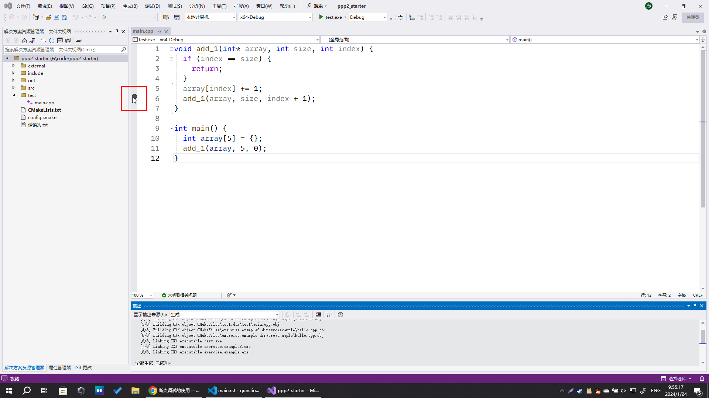
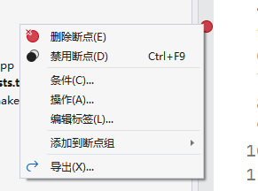
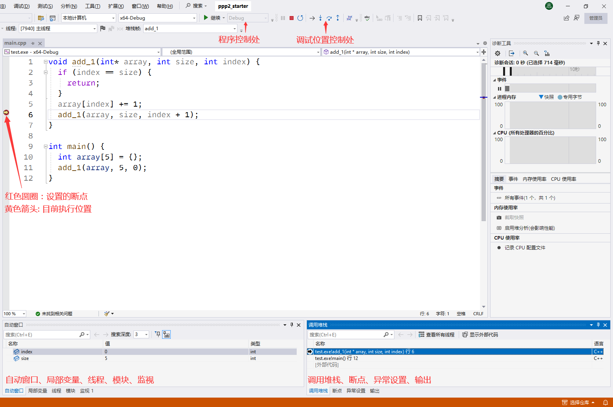
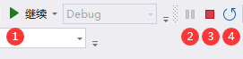
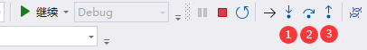
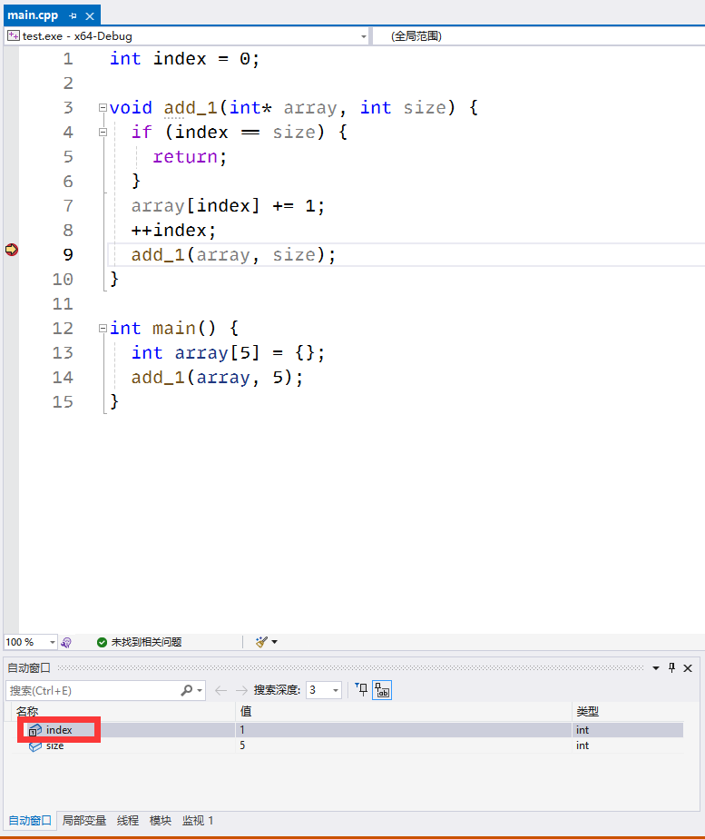
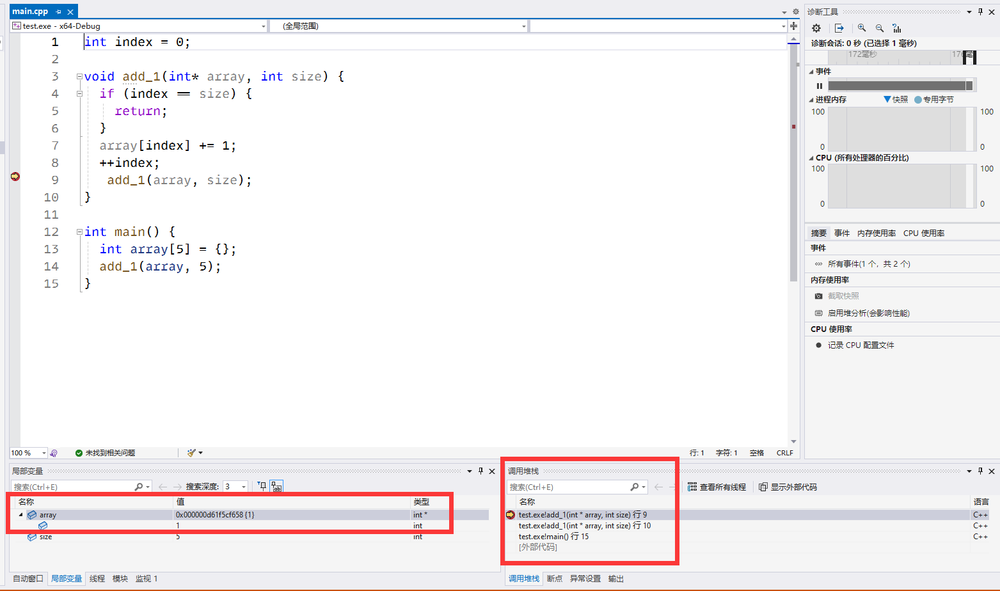
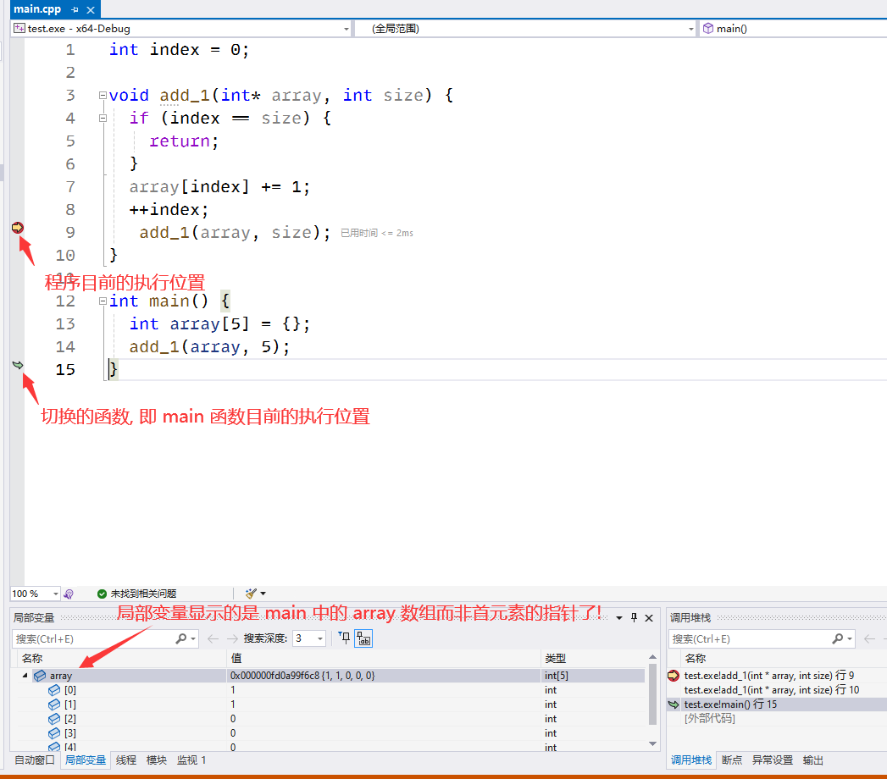

.. _debugger:

************************************************************************************************************************
断点调试的使用
************************************************************************************************************************

断点调试就是在源代码的某一行设置一个断点 (breakpoint), 开始调试时, 程序运行到这个断点位置且满足断点条件时 (称为命中, hit) 就会停住, 然后可以一步步往下调试. 调试过程中

- 可以实时显示各变量的当前值.
- 可以额外设置表达式查看它的对应值.
- 可以让程序到达断点时输出日志信息.
- ……

不同图形软件的断点调试方式没有大的区别, 此处以 Visual Studio 2022 为例.

.. code-block:: cpp
  :linenos:
  :caption: 教程中使用的示例代码

  int index = 0;

  void add_1(int* array, int size) {
    if (index == size) {
      return;
    }
    array[index] += 1;
    ++index;
    add_1(array, size);
  }
  
  int main() {
    int array[5] = {};
    add_1(array, 5);
  }

========================================================================================================================
设置断点
========================================================================================================================

鼠标指向在 :guilabel:`代码编辑区` 行号的左侧部分, 会发现鼠标位置出现一个圆圈, :KBD:`左击` 即可在对应行设置断点.

  断点设置

添加断点后, :KBD:`右击` 可以再设置特殊功能: (你也可以 :KBD:`右击` 该区域直接添加特殊功能的断点)

- 条件: 给断点设置命中条件, 可以设置表达式、命中次数等, 当命中条件满足时断点才会被命中. 例如我们只想让 :cpp:`i == 10` 时命中断点, 则可设置条件表达式 :cpp:`i == 10`.
- 操作/日志: 要求命中断点时输出自定义的消息.
- ……

  添加断点特殊功能

========================================================================================================================
执行调试
========================================================================================================================

设置好断点后, 确认自己处于 Debug 或 RelWithDebInfo 模式, 通过 :menuselection:`调试(D) --> 开始调试(S)` 或按 :KBD:`F5` 执行调试.

.. figure:: Debug 模式.png

  Debug 模式

.. admonition:: 不同的构建配置

  常见的构建配置 (build_type) 有:
  
  Debug
    调试版本, 一般由程序员用于调试. 它不对代码做任何优化并且会记录代码与程序间的对应关系 (称为调试信息), 从而允许实际地逐行执行代码.
  
  Release
    发行版本, 即最终发布给用户的版本. 基于 as-if 规则, 它只需要保证程序运行起来就像代码看起来那样 (as-is), 因而可以对代码进行尽可能的优化.
    
    需要注意的是, 针对程序中的有符号数溢出、下标越界等未定义行为, 它怎么优化都可以, 因而即使炸掉你的电脑也是可能的, 所以不要让代码中有未定义行为.
  
  RelWithDebInfo
    具有调试信息的发行版本. 由于未定义行为等的存在, 我们可能遇到调试版本能正常运行, 但发行版本出现问题的情况, 此构建配置即用于调试这种情况.
    
    由于发行版本对代码进行优化, 调试过程中可能出现一下跳过好几行的情况, 这是正常的.
  
  MinSizeRel
    以最小大小为首要目标进行优化的发行版本.

  **喜欢谈优化的新手请先知道有不同的构建配置; 抱怨程序慢的人请先切换到 Release 构建配置.**

========================================================================================================================
阅读和控制调试
========================================================================================================================

在执行调试后, 程序会执行直到中断 (命中断点、抛出异常等等). 此后我们得到以下界面:

  断点界面

------------------------------------------------------------------------------------------------------------------------
程序控制处
------------------------------------------------------------------------------------------------------------------------

对整个程序进行控制.

  程序控制处

#. :guilabel:`执行调试/继续`: 继续执行程序直到中断.
#. :guilabel:`暂停`: 如果程序正在执行, 中断程序.
#. :guilabel:`停止`: 停止执行程序.
#. :guilabel:`重启`: 重启程序.

------------------------------------------------------------------------------------------------------------------------
调试位置控制处
------------------------------------------------------------------------------------------------------------------------

让命中断点或因其他原因中断的程序按要求执行:

  调试位置控制处

#. :guilabel:`逐语句`: 像正常执行程序一样一句句执行, 如果遇到函数调用则进入函数内部进行调试.
#. :guilabel:`逐过程`: 类似逐语句, 除了遇到函数调用时会直接完全执行该函数, 不调试函数内部.
#. :guilabel:`跳出`: 执行直到当前函数返回, 回到调用该函数的函数中.

一些调试器还允许更多的执行方式:

#. :guilabel:`逐指令`: 一条语句可能非常复杂 (例如 :cpp:`a * (b + c * d)`), 编译后会对应于多条指令, 逐指令允许我们一条条指令进行调试.
#. :guilabel:`撤销`: 撤销之前的执行, 回到前一个位置.

------------------------------------------------------------------------------------------------------------------------
变量窗口
------------------------------------------------------------------------------------------------------------------------

显示变量的名称、值和类型等, 不同的类型会有不同的显示格式以辅助调试, 例如指针可以展开直接查看指向对象的内容.

通过变量窗口, 你可以:

- 查看变量的信息.
- 修改此时变量的值.
- :menuselection:`右键 --> 值更改时中断`.
- ……

变量窗口可分为:

自动窗口
  这是 Visual Studio 特殊的功能, 会搜集显示它认为重要的变量信息, 例如函数所使用的全局变量等.

局部变量
  显示函数内的局部变量.

监视
  允许填入表达式从而实时查看其值变化.
  
  例如对于数组 :cpp:`int array[10000]`, 你可能只想关注 :cpp:`array[50]` 的值, 则可以添加表达式 :cpp:`array[50]`.

  又如对于浮点数 :cpp:`double value`, 你可能更关注它对应的 :cpp:`int` 值, 则可以添加表达式 :cpp:`static_cast<int>(value)`.

  调试到 :cpp:`add_1()` 内时, 自动窗口搜集 :cpp:`index` 变量信息

------------------------------------------------------------------------------------------------------------------------
调用堆栈
------------------------------------------------------------------------------------------------------------------------

显示目前的函数调用信息.

  调用堆栈

如上图中我在第二次调用 :cpp:`add_1()` 时中断, 从图中可知函数调用信息如下所示, 其中行号表示该函数目前执行到的语句:

.. code-block:: text
  :linenos:

  add_1() 行 9
  add_1() 行 10
  main() 行 15

我们可以双击调用堆栈中的函数, 从而切换到该函数.

  切换函数

------------------------------------------------------------------------------------------------------------------------
其他功能
------------------------------------------------------------------------------------------------------------------------

目前仅展示了界面上可见的一些功能, 实际上用图形软件调试时, 鼠标也有一些特殊功能, 例如:

- 鼠标放在表达式上可以看到表达式的当前值.
- 鼠标右键表达式可以将它添加到监视中.
- 鼠标放在语句上可以选择执行到该条语句.

但这些功能在不同图形软件上表现迥异, 故此处不再解释, 请自行发掘.

========================================================================================================================
C 风格数组传参后怎么办?
========================================================================================================================

回到调用堆栈的例子,

  调用堆栈

注意到由于 C 风格数组传参时隐式类型转换为首元素的指针, 局部变量中 :cpp:`int* array` 只能看到数组中首元素的值, 可我们实际是在对数组进行操作, 该怎么看到整个数组的变化呢?

以下提供两种方法, 

1. 就像之前所演示的, 我们切换调用堆栈到 :cpp:`main()` 函数. 因为 :cpp:`main()` 函数中的 :cpp:`array` 类型确实是数组, 所以我们能看到整个数组的内容.
2. 在监视窗口填入 :cpp:`reinterpret_cast<int (*)[5]>(array)`, 这会将传入的 :cpp:`int* array` 强制转换为指向数组的指针 :cpp:`int (*)[5]`, 从而恢复数组的类型信息.

.. warning::

  这是 C 风格数组很容易隐式类型转换成指向首元素的指针所带来的硬伤, 有可能的话应该用 :cpp:`std::array<T, Size>` 或 :cpp:`std::vector<T>` 替代它.

========================================================================================================================
习题
========================================================================================================================

请在不修改代码的情况下调试代码, 并回答以下问题: (每问的调试可分别进行)

1. :doc:`sizeof 的功能是获取类型的大小 </faq/basic_concepts/sizeof>`. :cpp:`sizeof(array)` 和 :cpp:`sizeof(array[0])` 分别是获取哪个类型的大小?
2. :cpp:`sizeof(array) / sizeof(array[0])` 的目的是什么?
3. :cpp:`function()` 函数实现了什么功能?
4. 第三次调用 :cpp:`impl()` 函数且刚刚进入函数内时, :cpp:`array` 元素的内容是什么?
5. :cpp:`function()` 函数是如何实现它的功能的?

.. literalinclude:: exercise.cpp
  :language: cpp
  :linenos:

.. admonition:: 点击查看答案
  :class: dropdown, solution

  1. 在 :cpp:`main()` 函数内设置断点, 并在监视窗口填入 :cpp:`array` 和 :cpp:`array[0]` 得知, 它们的类型分别是 :cpp:`int[7]` 和 :cpp:`int`.
  2. 由 1, :cpp:`sizeof(array)` 获取整个数组的大小, :cpp:`sizeof(array[0])` 获取数组中元素的大小, 则相除得到数组的长度.
  3. 在 :cpp:`main()` 函数调用 :cpp:`function()` 前设置断点, 用 :guilabel:`逐过程` 进行调试, 发现调用 :cpp:`function()` 后 :cpp:`array` 被按非降序排序了, 可猜测 :cpp:`function()` 的功能是按非降序排序.
  4. 在 :cpp:`impl()` 最开始设置条件断点, 命中条件设置为 "命中次数 = 3", 执行调试后切换调用堆栈到 :cpp:`main()`, 发现 :cpp:`array` 的内容是 :cpp:`{6, 7, 5, 4, 3, 2, 1}`
  5. 在 :cpp:`impl()` 最开始设置断点, 不断 :guilabel:`执行调试/继续` 并观察每次命中断点时 :cpp:`array` 的内容变化,

     .. code-block:: text
       :linenos:

       {7} | {6, 5, 4, 3, 2, 1}
       {6, 7} | {5, 4, 3, 2, 1}
       {5, 6, 7} | {4, 3, 2, 1}
       {4, 5, 6, 7} | {3, 2, 1}
       {3, 4, 5, 6, 7} | {2, 1}
       {2, 3, 4, 5, 6, 7} | {1}
       {1, 2, 3, 4, 5, 6, 7}

     每次都将右边部分第一个元素插入到左边构成非降序, 这是插入排序.

========================================================================================================================
一个教学的黑点
========================================================================================================================

通过断点调试可以自由直观地查看代码中的内容变化, 然而教学中却喜欢把代码贴在幻灯片上, 在旁边放上输出, 更可怕的是, 由于代码过长把输出放到第二页, 来回翻页让学生查看.

========================================================================================================================
学会断点调试之后呢?
========================================================================================================================

本文涉及的断点调试仅仅是断点调试最基础的功能, 随便打开 Visual Studio 上方的 :menuselection:`调试` 菜单, 就会发现大量本文未涉及的功能.

我对调试器的学习也不多, 此处仅列举一些知道的材料:

- Visual Studio

  - `Debugger documentation - Visual Studio (Windows) <https://learn.microsoft.com/en-us/visualstudio/debugger/>`_

- LLDB

  - `LLDB Documentation <https://lldb.llvm.org/>`_

  - `Dancing in the Debugger — A Waltz with LLDB <https://www.objc.io/issues/19-debugging/lldb-debugging/>`_

- GDB

  - `GDB Documentation <https://www.sourceware.org/gdb/documentation/>`_

  - `Give me 15 minutes & I'll change your view of GDB - Greg Law - CppCon 2015`_ 及 Greg Law 的其他视频
