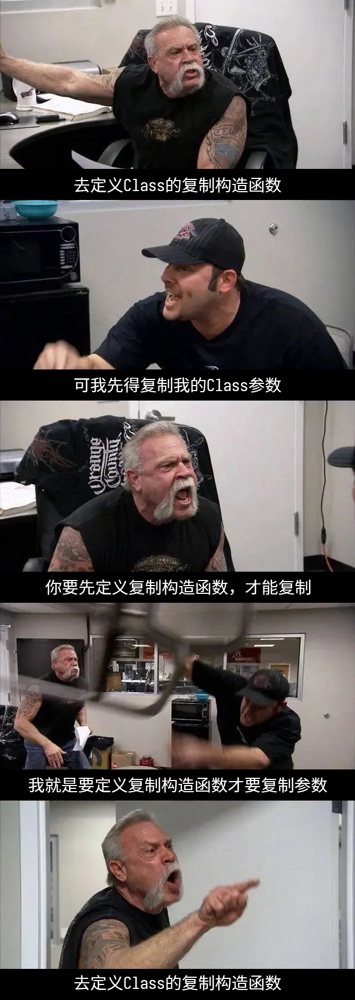

************************************************************************************************************************
拷贝构造/赋值函数的参数: 为什么我的拷贝函数报错?
************************************************************************************************************************

拷贝函数用 :cpp:`Widget(Widget const& other)` 和 :cpp:`operator=(Widget const& other)`.

本解答是很多人用 :cpp:`&` 作为参数出错而提问, 我忍无可忍的结果.

========================================================================================================================
为什么不是 :cpp:`Widget(Widget other)` 和 :cpp:`operator=(Widget other)`?
========================================================================================================================

定义拷贝构造函数的目的是什么? 是为了描述 :cpp:`Widget` 对象如何进行拷贝.

当用 :cpp:`Widget(Widget other)` 时, 我们就是在说, :cpp:`Widget` 先进行拷贝传参, 传入参数后进行拷贝. 拷贝传参也是在拷贝 :cpp:`Widget`, 所以我们要为了拷贝传参这次拷贝进行拷贝传参, 传入参数后进行拷贝……

从前有座山, 山里有座庙, 庙里有个老和尚在讲故事, 讲的是从前有座山, 山里有座庙, 庙里有个老和尚在讲故事……

**发生无限的递归.**

  :cpp:`Widget(Widget other)` 带来的递归问题. (以前做的图, 用语不太一样)

========================================================================================================================
为什么不是 :cpp:`Widget(Widget& other)` 和 :cpp:`operator=(Widget& other)`?
========================================================================================================================

------------------------------------------------------------------------------------------------------------------------
拷贝只是读取数据, 不会修改 :cpp:`other`
------------------------------------------------------------------------------------------------------------------------

按照拷贝的逻辑, 我们是从 :cpp:`other` 中读取数据, 它本身的数据不应该发生任何变化, 为了避免被修改, 应该使用 :cpp:`Widget const&` 传递参数. 将 :cpp:`other` 作为只读参数, 这称为输入参数.

.. code-block:: cpp
  :linenos:
  :caption: :cpp:`Widget&` 被意外修改

  class Widget {
   public:
    Widget(Widget& other) {
      /*...*/
      --other.value_;  // 意外被修改!
    }
  
   private:
    int value_;
  };

------------------------------------------------------------------------------------------------------------------------
:cpp:`Widget&` 只能引用左值, 但很多情况需要用右值拷贝
------------------------------------------------------------------------------------------------------------------------

.. seealso::

  - :doc:`/faq/basic_concepts/value_category`

.. code-block:: cpp
  :linenos:
  :caption: :cpp:`Widget&` 报错

  class Widget {
   public:
    Widget(Widget& other);
  };

  Widget function();

  int main() {
    Widget widget = function();  // 错误: function 返回了一个临时对象, 不能被引用而用于拷贝!
  }

.. code-block:: cpp
  :linenos:
  :caption: :cpp:`Widget const&` 正常运行

  class Widget {
   public:
    Widget(Widget const& other);
  };

  Widget function();

  int main() {
    Widget widget = function();  // 正确!
  }

.. admonition:: 相关核心准则

  - :coreguidelines:`C.60: 拷贝赋值函数应该是非虚函数, 按 const& 传参, 并按 & 返回自身 <c60-make-copy-assignment-non-virtual-take-the-parameter-by-const-and-return-by-non-const>`

.. danger::

  以上内容是针对 C++98~C++23 的泛用解答, 随着版本变化, 很多细节会有差异.

  事实上很多解答都存在这样的问题, 因为教学使用的 C++98 太过时了, VS 2017 默认版本是 C++14, gcc 11 和 clang 16 默认版本是 C++17.

  这里引起的争议比较大, 所以免责声明一下.
