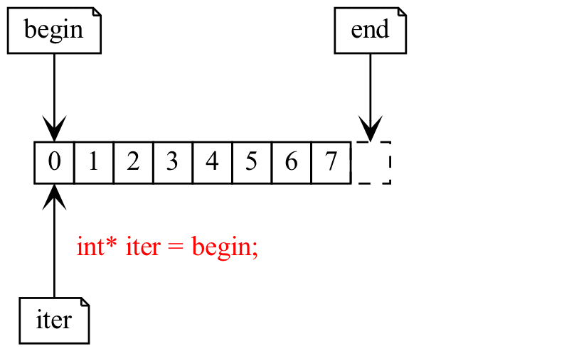

************************************************************************************************************************
范围和迭代器 (range and iterator)
************************************************************************************************************************

.. seealso::

  - :doc:`/faq/basic_concepts/auto`
  - :doc:`/faq/basic_concepts/c_array`
  - :doc:`/faq/basic_concepts/operator_overloading`
  - :doc:`/faq/basic_concepts/template`

========================================================================================================================
范围 (range)
========================================================================================================================

在 :doc:`/faq/basic_concepts/c_array` 中, 我留下了这样一段代码:

.. code-block:: cpp
  :linenos:

  void print(int const* begin, int const* end) {
    for (auto iter = begin; iter != end; ++iter) {
      std::cout << *iter << ' ';
    }
  }

  int main() {
    int array[5] = {0, 1, 2, 3, 4};
    print(array + 1, array + 3);  // 输出 1 2
    print(array + 2, array + 5);  // 输出 2 3 4
  }

可以发现, 我们完全可以传入数组的一个子部分, 单独对那个部分进行操作. 这样由一个 *起始点* 和一个 *结束点* 描述的一部分 (一系列值的集合), 称为范围 (range).

在 C++ 中, 范围通常用半开区间 :cpp:`[begin, end)` 表示, 例如 :cpp:`print(array + 1, array +3)` 即是传入范围 :cpp:`[array + 1, array + 3)`.

:cpp:`begin`
  指向范围中第一个元素.

:cpp:`end`
  指向范围中最后一个元素之后一个位置.

========================================================================================================================
迭代器 (iterator)
========================================================================================================================

TODO, 应该按照 `STL and Its Design Principles - Alexander Stepanov <https://www.youtube.com/watch?v=YlVUzJwN_Xc>`_ 的逻辑, 从指针引入.

========================================================================================================================
迭代器和下标的区别?
========================================================================================================================

TODO, `[语法询问] 关于迭代器iterator的疑问 <https://gitee.com/cpp_tutorial/question/issues/I8SEIM>`_

========================================================================================================================
再看范围
========================================================================================================================

TODO