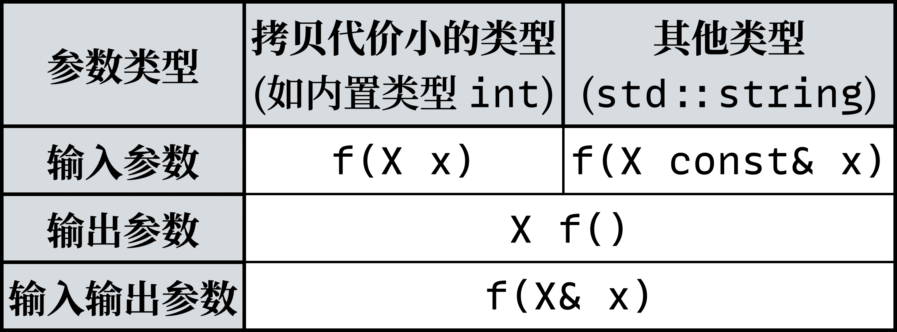

************************************************************************************************************************
函数参数 (function parameter)
************************************************************************************************************************

按传值、传指针、传引用来区分参数是没有意义的, 我们更应该考虑参数的实际用途: 不是去考虑我们应该怎样传参, 而是 **去考虑我们要用这个参数做什么**.

对于一个变量我们可以进行读取和写入, 那么对于参数也是如此:

输入参数 (in parameter): 通过参数为函数输入值.
  函数只从实际参数中读取信息, 而不修改实际参数的信息.

  .. code-block:: cpp
    :linenos:

    void function(int value) {
      value = value * 5;
      cout << value;  // 输出 5
    }

    int main() {
      int value = 1;
      function(value);
      cout << value;  // 输出 1
    }

输出参数 (out parameter): 通过参数为函数输出值.
  函数只修改实际参数的信息, 而不读取实际参数的任何信息.

  .. code-block:: cpp
    :linenos:

    void function(int& value) {
      value = 5;
    }

    int main() {
      int value = 1;
      function(value);
      cout << value;  // 输出 5
    }

输入输出参数 (in-out parameter): 通过参数为函数输入值, 并输出值.
  函数既从实际参数中读取信息, 又修改实际参数的信息.

  .. code-block:: cpp
    :linenos:

    void function(int& value) {
      std::cout << value;  // 输出 1
      value = 5;
    }

    int main() {
      int value = 1;
      function(value);
      cout << value;  // 输出 5
    }

.. admonition:: 相关提案
  :class: coreguidelines

  - `D0708: 参数传递 - 保证统一的初始化和值设置 <https://github.com/hsutter/708/blob/main/708.pdf>`_
  - :wg21:`P2668: 基于用途的参数传递 <p2668>`

========================================================================================================================
传参决策
========================================================================================================================

  C++98 传参决策

.. admonition:: 相关核心准则
  :class: coreguidelines

  - :coreguidelines:`F.15: 倾向于简单常规的传递信息方式 <f15-prefer-simple-and-conventional-ways-of-passing-information>`
  - :coreguidelines:`F.16: 对于输入参数, 按值传递拷贝开销低的类型, 按 const& 传递其他类型 <f16-for-in-parameters-pass-cheaply-copied-types-by-value-and-others-by-reference-to-const>`
  - :coreguidelines:`F.17: 对于输入输出参数, 按非 const 的 & 传递 <f17-for-in-out-parameters-pass-by-reference-to-non-const>`
  - :coreguidelines:`F.20: 对于输出值, 倾向于使用返回值而非输出参数 <f20-for-out-output-values-prefer-return-values-to-output-parameters>`
  - :coreguidelines:`F.21: 要输出多个值, 倾向于返回一个结构体 <f21-to-return-multiple-out-values-prefer-returning-a-struct>`

------------------------------------------------------------------------------------------------------------------------
决策由来: 常见传参方式的用途分析
------------------------------------------------------------------------------------------------------------------------

我们来分析一下见过的传参方式, 对它们的用途进行分类.

其中 :cpp:`parameter` 表示参数列表中的形式参数, :cpp:`argument` 表示调用时传递的实际参数.

:cpp:`function(int parameter)`
  按值传参发生拷贝, :cpp:`int parameter = argument` 是从实际参数拷贝得到的新对象, 因此自然不可能通过 :cpp:`parameter` 修改 :cpp:`argument`, 是 **输入参数**.

:cpp:`function(int& parameter)`
  按引用传参, :cpp:`int& parameter = argument` 是对实际参数的引用, 对 :cpp:`parameter` 的任何操作其实就是对 :cpp:`argument` 的操作, 是 **输出参数** (如果只写入) 或 **输入输出参数** (既读取又写入).

:cpp:`function(int const& parameter)`
  按 const 引用传参, :cpp:`int const& parameter = argument` 是对实际参数的引用, 对 :cpp:`parameter` 的任何操作其实就是对 :cpp:`argument` 的操作, **但这个引用只能用于读取不能用于写入**, 是 **输入参数**.

:cpp:`function(int* parameter)`
  按指针传参, :cpp:`int* parameter = &argument` 指向实际参数, 对 :cpp:`*parameter` 的任何操作其实就是对 :cpp:`argument` 的操作, 是 **输出参数** (如果只写入) 或 **输入输出参数** (既读取又写入).

:cpp:`function(int const* parameter)`
  按 const 指针传参, :cpp:`int const* parameter = &argument` 指向实际参数, 对 :cpp:`*parameter` 的任何操作其实就是对 :cpp:`argument` 的操作, **但这个解引用只能用于读取不能用于写入**, 是 **输入参数**.

------------------------------------------------------------------------------------------------------------------------
决策由来: 使用返回值而非输出参数
------------------------------------------------------------------------------------------------------------------------

输出参数方式并不直接:

.. code-block:: cpp
  :linenos:

  void function(int& value) {
    value = 5;
  }

  /* 中间隔了几百行代码 */

  int main() {
    int value = 1;
    function(value);     // 传入参数, 应该不会改变我的 value, 对、对吧?
    std::cout << value;  // 输出 5😱
  }

相比于输出参数, 我们有一个更好的输出方案——返回值:

.. code-block:: cpp
  :linenos:

  int function() {
    return 5;
  }

  int main() {
    int value = function();
  }

如果需要返回多个值, 使用结构体:

.. code-block:: cpp
  :linenos:

  struct Symmetric_minus_result {
    int lhs_minus_rhs;
    int rhs_minus_lhs;
  };

  Symmetric_minus_result symmetric_minus(int lhs, int rhs) {
    return {lhs - rhs, rhs - lhs};
  }

.. admonition:: 相关核心准则
  :class: coreguidelines

  - `停止使用输出参数 <https://stlab.cc/tips/stop-using-out-arguments.html>`_
  - :coreguidelines:`F.20: 对于输出值, 倾向于使用返回值而非输出参数 <f20-for-out-output-values-prefer-return-values-to-output-parameters>`
  - :coreguidelines:`F.21: 要输出多个值, 倾向于返回一个结构体 <f21-to-return-multiple-out-values-prefer-returning-a-struct>`

========================================================================================================================
传值? 传指针?
========================================================================================================================

这样以参数的实际用途来分析, 才是最反映我们编写代码的逻辑的, 也是最符合事实的: 传指针其实也是传值, 之所以区别开来教, 就是内含了用参数的实际用途来区别的想法.

以 :cpp:`by_value(int value)` 和 :cpp:`by_pointer(int* pointer)` 为例.

:cpp:`by_value(int value)` 调用时, 拷贝的是 :cpp:`int` 类型; 而 :cpp:`by_pointer(int* pointer)` 调用时, 拷贝的是 :cpp:`int*` 类型.

在 :doc:`/faq/basic_concepts/pointer` 中已指出, 指针是一个对象, 它存储了指向对象的地址, 自然拷贝得到的新指针也存储了那个地址. 因此自然地, 这个新指针解引用也能访问那个指向的对象:

.. code-block:: cpp
  :linenos:

  int temp = 5;

  void function(int* pointer) {
    pointer = &temp;  // pointer 指向 temp
  }

  int main() {
    int value    = 0;
    int* pointer = &value;  // &value 取地址, 得到指向 value 的一个指针

    function(pointer);      // 调用时这个指针也是传值, 发生拷贝, 只是拷贝得到的指针也指向 value

    std::cout << *pointer;  // 输出 0, 它依然指向 value!
  }

========================================================================================================================
相关解答
========================================================================================================================

- :doc:`/faq/copy_functions_parameter/index`
