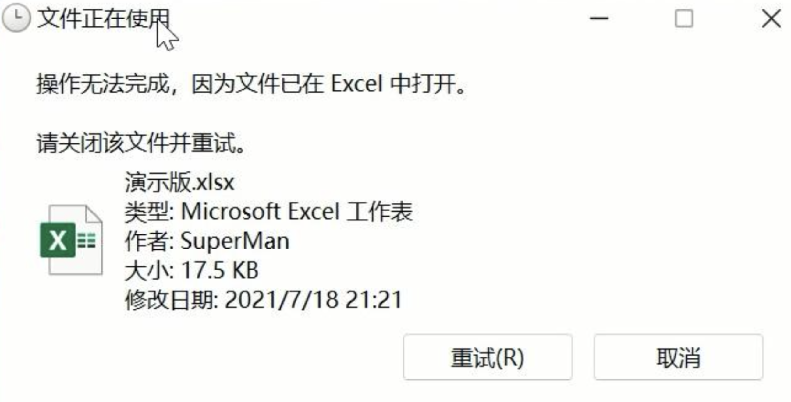
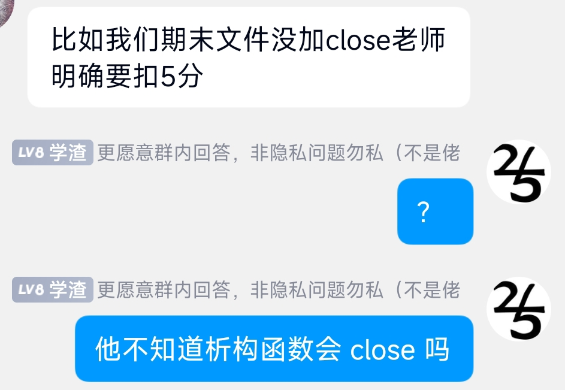

************************************************************************************************************************
资源 (resource)
************************************************************************************************************************

资源是一种概念, 意指某种需要预先获取、之后释放的东西, 例如文件、内存等.

.. code-block:: cpp
  :linenos:

  file* file = open_file("text.txt");  // 获取文件资源
  /* 对打开的文件进行操作 */
  close_file(file);  // 释放文件资源

========================================================================================================================
所有权 (ownership)
========================================================================================================================

如果一个对象须负责释放某种资源, 则称该对象具有该资源的所有权.

.. code-block:: cpp
  :linenos:

  file* file = open_file("text.txt");
  close_file(file);  // file 须负责释放文件资源, 它具有该资源的所有权

  int value    = 0;
  int* pointer = &value;  // pointer 不需要负责释放 value, 只是引用, 不具有所有权

如果具有所有权的对象没有尽责地释放资源, 将会发生非常恐怖的事情. 例如 :cpp:`file` 占用了 ``text.txt`` 文件, 如果不进行释放, 则意味着往后再也没有对象可以对 ``text.txt`` 文件进行操作.

.. code-block:: cpp

  // 程序 A
  int main() {
    file* file = open_file("text.txt");
  }  // 离开 main 时, file 被析构, 但是它指向的文件资源没有被释放

  // 程序 B
  int main() {
    file* file = open_file("text.txt");  // 错误: 文件被占用!
  }

  文件被占用

========================================================================================================================
作用域限定的资源管理 (scope bound resource management)
========================================================================================================================

你需要记住哪个对象具有哪些资源的所有权, 并在对象析构之前记得释放资源, 这太累了!

让我们想想, 有没有一种 "资源" 是自动就完成释放的?

.. code-block:: cpp
  :linenos:

  int main() {
    int value = 0;  // 还记得对象的定义吗? 它占有内存资源!
  }  // value 被析构, 占有的内存资源随之释放

对象析构时, 它本身的内存 "资源" 被自动释放.

让我们再想想, 有没有一种方法定义对象析构时的行为?

.. code-block:: cpp
  :linenos:

  class Widget {
   public:
    ~Widget() { std::cout << "析构函数被调用!\n" }
  };

所以我们可以将文件资源包装为一个类, 构造函数时获取文件资源, 析构函数时释放文件资源:

.. code-block:: cpp
  :linenos:

  class File {
   public:
    //                                   ↓ 对 file_ 成员初始化
    File(std::string const& file_path) : file_{open_file(file_path)} {}
    ~File() { close_file(file_); }
    // ...

   private:
    file* file_;
  };

  int main() {
    File file("text.txt");
  }  // file 析构时自动释放 text.txt 文件

.. epigraph:: 

  那时我常用这样的方式解释有关概念, 有一个构造函数, 它建立其他成员函数进行操作的环境基础; 另有一个析构函数来销毁这个环境, 并释放它以前获得的所有资源.

  — Bjarne Stroustrup《The Design and Evolution of C++》

.. note::

  这种技术通常称为 "资源获取即初始化" (Resource Acquisition is Initialization, RAII), 但这名字并没有表现析构函数的作用, Bjarne Stroustrup 本人也多次表示自己取了个坏名字, 只是由于广泛流传而难以纠正.

  所以此处选用了 Kate Gregory 在 `Naming is Hard: Let's Do Better - Kate Gregory - CppCon 2019`_ 中的命名.

.. admonition:: 相关核心准则
  :class: coreguidelines

  - :coreguidelines:`P.8: 不要泄露任何资源 <p8-dont-leak-any-resources>`
  - :coreguidelines:`C.30: 如果类在对象析构时需要显式操作, 定义析构函数 <c30-define-a-destructor-if-a-class-needs-an-explicit-action-at-object-destruction>`
  - :coreguidelines:`C.31: 类获取的所有资源必须由类的析构函数释放 <c31-all-resources-acquired-by-a-class-must-be-released-by-the-classs-destructor>`
  - :coreguidelines:`C.32: 如果类有一个裸指针 (T*) 或裸引用 (T&), 考虑它是否具有所有权 <c32-if-a-class-has-a-raw-pointer-t-or-reference-t-consider-whether-it-might-be-owning>`
  - :coreguidelines:`C.33: 如果类有一个所有权指针, 定义析构函数 <c33-if-a-class-has-an-owning-pointer-member-define-a-destructor>`
  - :coreguidelines:`R: 资源管理 <r-resource-management>` 一整节

========================================================================================================================
一个教学的黑点
========================================================================================================================

========================================================================================================================
相关解答
========================================================================================================================

- :doc:`/faq/rule_of_350/main`
