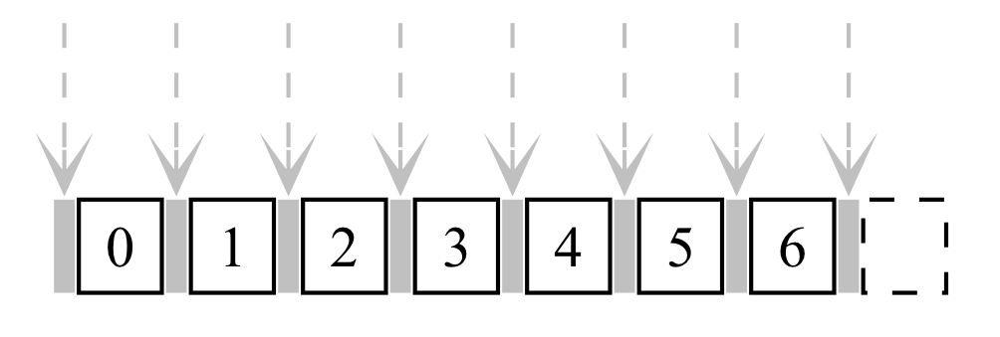
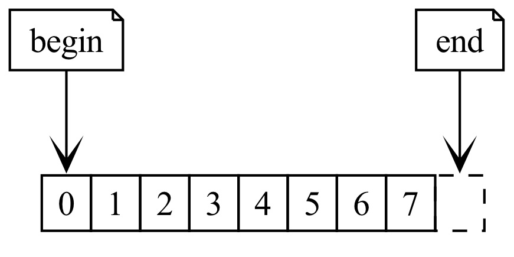
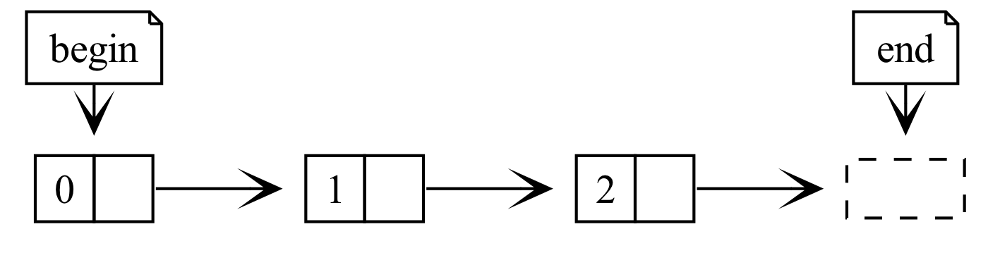

************************************************************************************************************************
实例分析: 单向链表 (forward list)
************************************************************************************************************************

.. admonition:: 前置内容
  :class: precontent

  - :doc:`/faq/basic_concepts/object`
  - :doc:`/faq/basic_concepts/initialization_assignment`
  - :doc:`/faq/basic_concepts/struct`
  - :doc:`/faq/basic_concepts/pointer`
  - :doc:`/faq/class_invariant/main`

========================================================================================================================
关注逻辑、忽略数据
========================================================================================================================

由于教材原因, 新手可能在最开始接触到这样的链表结点:

.. code-block:: cpp
  :linenos:

  struct Student {
    std::string id;
    std::string name;
    int grade;
    Student* link;  // 到下一个学生的连接
  };

这给对链表的理解带来了完全不必要的麻烦: 从学生这个词语, 我们完全看不出它会连接下一个学生.

所以我们首先对数据的存储进行抽象, 用类型别名来替代存储的数据, 将链表结点确确实实地命名为 :cpp:`Node` (结点):

.. code-block:: cpp
  :linenos:
  :caption: 类型别名

  using value_type = int;  // value_type 是 int 的别名

  value_type value = 0;  // 相当于 int value = 0;

.. code-block:: cpp
  :linenos:
  :caption: 链表结点

  using value_type = int;

  struct Node {
    value_type value;
    Node* next;  // 既然是到下一个结点, 那直接命名为 next 多好!
  };

========================================================================================================================
建立结点间的连接关系
========================================================================================================================

结点之间的连接是通过 :cpp:`next` 成员完成的, 跟存储的数据没有关系. 例如在 :cpp:`main` 函数中有三个结点, 以下代码则建立起它们之间的连接:

.. code-block:: cpp
  :linenos:

  int main() {
    // 初始化时, 下一个结点是 nullptr (空结点), 则三个结点之间没有连接
    Node node0 = {0, nullptr};  // value = 0, next = nullptr
    Node node1 = {1, nullptr};
    Node node2 = {2, nullptr};

    node0.next = &node1;  // 建立 node0 -> node1
    node1.next = &node2;  // 建立 node1 -> node2

    // 此时 node0 -> node1 -> node2 -> nullptr
  }

可见结点间的连接完全基于 :cpp:`next` 连接的结点是什么, 我们通过 :cpp:`node.next` 即能得到下一个结点.

由此可以编写打印函数: :godbolt:`41TYTzPP5`

.. code-block:: cpp
  :linenos:

  void print(Node const* begin) {
    for (Node const* node = begin;  // 从 begin 开始遍历;
         node != nullptr;           // 遍历直到结点是空结点;
         node = node->next) {       // 获取下一个结点
      std::cout << node->value << " -> ";
    }
    std::cout << "nullptr\n";
  }

.. hint::

  你当然可以让两个结点相互指向, 即:

  .. code-block:: cpp
    :linenos:

    Node left   = {0, nullptr};
    Node right  = {1, nullptr};
    left.next   = &right;
    right.next  = &left;
    // left ⇄ right

  但我们显然不把这称为单向链表, 你也许可以称它为循环链表或其他东西.

  数据结构都具有 :doc:`不变式 </faq/class_invariant/main>` 即逻辑关系, 对于单向链表而言就是:

  - 链表中上一个结点都指向下一个结点, 而不会反过来或指向其他结点;
  - 链表中最后一个结点指向空结点.

========================================================================================================================
向后插入结点
========================================================================================================================

我们已经知道了 *如何连接结点从而建立链表* 和 *如何在链表中进行遍历*, 接下来考虑如何插入结点. 此处以向已有结点 :cpp:`position` 之后插入结点 :cpp:`new_node` 为例, 这是单向链表最自然的情况.

已知结点 :cpp:`position`, 则可以得到它的后续结点 :cpp:`position.next`. 而所谓在 :cpp:`position` 之后插入结点, 就是把结点插入到 :cpp:`position` 和 :cpp:`position.next` 之间, 且仍然保持单向链表的逻辑关系, 因而插入后应该有:

.. code-block:: cpp
  :linenos:

  ... -> position -> new_node -> position.next -> ...

注意到, 我们完全不在乎 :cpp:`position` 之前连接了什么结点, :cpp:`position.next` 之后连接了什么结点.

由此有: :godbolt:`ve73181v8`

.. code-block:: cpp
  :linenos:

  // 在 position 之后插入 new_node
  // 前置条件:：
  //  - position != nullptr, 即 position 是确实存在的结点.
  //  - new_node != nullptr, 即 new_node 是确实存在的结点.
  //
  // 返回值::
  //  返回指向新插入结点的指针
  Node* insert_after(Node* position, Node* new_node) {
    new_node->next = position->next;
    position->next = new_node;
    return new_node;
  }

  int main() {
    Node node0 = {0, nullptr};
    Node node2 = {2, nullptr};
    insert_after(&node0, &node2);
    // node0 -> node2 -> nullptr

    Node node1 = {1, nullptr};
    insert_after(&node0, &node1);
    // node0 -> node1 -> node2 -> nullptr
  }

为什么要返回新插入结点的指针? 这是为了方便连续插入: :godbolt:`dqjb31zv6`

.. code-block:: cpp
  :linenos:

  int main() {
    Node node0 = {0, nullptr};
    Node node1 = {1, nullptr};
    Node node2 = {2, nullptr};

    Node* node = &node0;
    node       = insert_after(node, &node1);
    node       = insert_after(node, &node2);
    // node0 -> node1 -> node2 -> nullptr
  }

========================================================================================================================
移除后一个结点
========================================================================================================================

与插入相对的, 是如何移除结点. 同样地, 对于单向链表, 移除已有结点 :cpp:`position` 之后一个结点是最自然的情况.

已知结点 :cpp:`position`, 则可以得到它的后续结点 :cpp:`position.next`. 而所谓移除 :cpp:`position` 之后一个结点, 就是将 :cpp:`position` 与 :cpp:`position.next.next` 直接连接, 并让 :cpp:`position.next` 连接到空结点, 从而将 :cpp:`position.next` 排除在链表的连接关系之外: :godbolt:`eGfzddj4h`

.. code-block:: cpp
  :linenos:

  // 移除 position 的下一个结点
  // 前置条件:：
  //  - position       != nullptr, 即 position       是确实存在的结点.
  //  - position->next != nullptr, 即 position->next 是确实存在的结点.
  //
  // 返回值::
  //  返回移除的结点.
  Node* remove_after(Node* position) {
    Node* to_be_removed = position->next;
    position->next      = to_be_removed->next;
    to_be_removed->next = nullptr;
    return to_be_removed;
  }

  int main() {
    Node node0 = {0, nullptr};
    Node node1 = {1, nullptr};
    insert_after(&node0, &node1);
    // node0 -> node1 -> nullptr

    remove_after(&node0);
    // node0 -> nullptr
  }

========================================================================================================================
统一管理结点资源
========================================================================================================================

但我们的链表还有一个可能致命的问题: 我们的链表结点是单独存储的, 且都是局部变量.

单独存储意味着要人脑记录连接情况.
  .. code-block:: cpp
    :linenos:

    int main() {
      Node node0 = {0, nullptr};
      Node node1 = {1, nullptr};
      Node node2 = {2, nullptr};
      Node node3 = {3, nullptr};
      insert_after(&node0, &node1);
      insert_after(&node1, &node2);

      /* 几十行代码 */
      insert_after(&node3, &node0);
      /* 几十行代码 */
    }

  在几十行代码之后, 你是否知道链表的首结点已经变成了 :cpp:`node3` 而不是 :cpp:`node0` 呢?

局部变量意味着整体拷贝后需要重新建立连接.
  类和结构体默认的拷贝行为是对成员进行逐一拷贝, 而指针拷贝后, 两个指针存储相同的地址值、指向同样的对象. 因此, 由于 :cpp:`Node* next` 是指针, 拷贝得到的结点仍指向原结点的后续结点.

  .. code-block:: cpp
    :linenos:

    int main() {
      Node node0 = {0, nullptr};
      Node node1 = {1, nullptr};
      insert_after(&node0, &node1);
      // node0 -> node1 -> nullptr

      Node copy0 = node0;  // copy0 -> node1 -> nullptr;
      Node copy1 = node1;  // copy1 -> nullptr
    }

我们需要 *统一管理链表结点的存储* 并且 *不存储为局部变量*, 因此我们使用 :cpp:`new` 将结点分配在堆空间, 通过 :cpp:`new` 所返回的指针访问结点, 使用完成后用 :cpp:`delete` 释放结点:

.. code-block:: cpp
  :linenos:

  int main() {
    // new 会在堆空间分配结点, 并返回得到指向该结点的指针
    Node* node0 = new Node{0, nullptr};
    Node* node1 = new Node{1, nullptr};

    insert_after(&node0, &node1);
    // node0 -> node1 -> nullptr;

    // 用 delete 释放结点
    delete node0;
    delete node1;
  }

要释放结点, 我们只需要有指向该结点的指针, 而单向链表恰能通过 :cpp:`Node* next` 得到后续结点的指针, 所以我们只要知道首结点就能通过遍历释放所有结点: :godbolt:`xGqdacdnq`

.. code-block:: cpp
  :linenos:

  void delete_list(Node* node) {
    while (node != nullptr) {
      Node* to_delete = node;
      node            = node->next;
      delete to_delete;
    }
  }

  int main() {
    Node* head = new Node{0, nullptr};

    Node* node = head;
    node       = insert_after(node, new Node{1, nullptr});
    node       = insert_after(node, new Node{2, nullptr});
    // 0 -> 1 -> 2 -> nullptr

    delete remove_after(head);
    // 0 -> 2 -> nullptr

    delete_list(head);  // 释放
  }

通过用首结点来表达整个链表的所有权, 我们有了链表从哪里开始的概念: 整个链表被首结点所有, 从首结点开始, 通过对首结点调用 :cpp:`delete_list` 进行释放.

为了更明确地表示首结点所具有的所有权, 我们实际地定义单向链表类: :godbolt:`MW5Tfrczc`

.. code-block:: cpp
  :linenos:

  struct Forward_list {
   public:
    Node* head;
  };

  int main() {
    Forward_list list = {new Node{0, nullptr}};

    Node* node = list.head;
    node       = insert_after(node, new Node{1, nullptr});
    node       = insert_after(node, new Node{2, nullptr});
    // 0 -> 1 -> 2 -> nullptr

    delete remove_after(list.head);
    // 0 -> 2 -> nullptr

    delete_list(list.head);  // 释放
  }

========================================================================================================================
让链表能包含其他类型的数据
========================================================================================================================

我们之前使用 :cpp:`using value_type = int;`, 从而淡化了链表存储的数据而专注于链表连接的建立. 其实这样做还带来另一个好处: 我们只需更改 :cpp:`using value_type = ...;` 为其他类型, 就能让链表包含其他类型的数据!

.. code-block:: cpp
  :linenos:

  using value_type = double;  // 现在, 结点存储的是 double 类型数据
  // ...

那么如果我想让链表存储学生类呢?

.. code-block:: cpp
  :linenos:

  struct Student {
    std::string id;
    std::string name;
  };

  using value_type = Student;

但当你编译生成会发现, 这样修改后会报错, 为什么呢? 因为我们在 :cpp:`print()` 函数中使用 :cpp:`std::cout << node->value` 进行输出, 而我们并没有对 :cpp:`Student` 定义这样的操作. 为此你可以:

- 为 :cpp:`Studnet` 定义一个输出函数, 将 :cpp:`std::cout << node->value` 替换为这个输出函数.
- 或学习 :doc:`运算符重载 </faq/basic_concepts/operator_overloading>` 并重载 :cpp:`std::cout << node->value`.

这当然还不够好, **你完全可以让链表用起来像 int 一样简单**, 再坚持往下读!

========================================================================================================================
扩展: 在任意位置插入结点
========================================================================================================================

由于单向链表天然只能通过 :cpp:`next` 访问下一个结点, 而不能直接访问上一个结点, 向后插入显然是单向链表插入中最自然的情况. 因此, 回顾一下我们目前有的向后插入函数会为我们带来不少灵感:

.. code-block:: cpp
  :linenos:

  // 在 position 之后插入 new_node
  // 前置条件:：
  //  - position != nullptr, 即 position 是确实存在的结点.
  //  - new_node != nullptr, 即 new_node 是确实存在的结点.
  //
  // 返回值::
  //  返回指向新插入结点的指针.
  Node* insert_after(Node* position, Node* new_node) {
    new_node->next = position->next;
    position->next = new_node;
    return new_node;
  }

注意到, 由于对 :cpp:`position` 进行了解引用, 该插入函数前置要求 :cpp:`position` 结点非空, 因而要求链表中至少有一个结点. 这给我们带来了第一个可供分类讨论的地方.

------------------------------------------------------------------------------------------------------------------------
非空链表的插入
------------------------------------------------------------------------------------------------------------------------

对于含有 n 个结点的链表, 一共有 n + 1 个插入位置. 其中有 n 个位置分别对应于向某结点之后插入, 还有 1 个位置是插入到首结点之前.

  存在 n + 1 个插入位置

^^^^^^^^^^^^^^^^^^^^^^^^^^^^^^^^^^^^^^^^^^^^^^^^^^^^^^^^^^^^^^^^^^^^^^^^^^^^^^^^^^^^^^^^^^^^^^^^^^^^^^^^^^^^^^^^^^^^^^^^
插入到结点之后
^^^^^^^^^^^^^^^^^^^^^^^^^^^^^^^^^^^^^^^^^^^^^^^^^^^^^^^^^^^^^^^^^^^^^^^^^^^^^^^^^^^^^^^^^^^^^^^^^^^^^^^^^^^^^^^^^^^^^^^^

针对插入到结点之后, 我们已经定义了如何插入 (即函数 :cpp:`insert_after(position, new_node)`), 唯一要做的是确定在哪个结点之后插入.

确定在哪个结点之后插入取决于具体的应用, 你可以选择:

.. tabs::

  .. tab:: 尾结点

    :godbolt:`4cq3ehsf4`

    .. code-block:: cpp
      :linenos:

      // 获取从 node 起链表的尾结点
      // 前置条件:：
      //  node != nullptr, 即 node 是确实存在的结点.
      Node* tail(Node* node) {
        for (; node->next != nullptr; node = node->next) {
        }
        return node;
      }

  .. tab:: 第 n 个结点

    :godbolt:`q73qqs3ba`

    .. code-block:: cpp
      :linenos:

      // 获取 node 之后第 step 个结点
      // 前置条件::
      //  - node 及之后 step - 1 个结点都确实存在.
      //  - step >= 0.
      Node* next(Node* node, int step = 1) {
        for (int i = 0; i < step; ++i) {
          node = node->next;
        }
        return node;
      }

  .. tab:: 第 n 个结点, 如果不足 n 个则尾结点

    :godbolt:`6GWqbnTa3`

    .. code-block:: cpp
      :linenos:

      // 获取 node 之后第 step 个结点, 如果不足 step 个, 则获取最后一个非空结点
      // 前置条件::
      //  - node != nullptr, 即 node 是确实存在的结点.
      //  - step >= 0.
      Node* sentineled_next(Node* node, int step = 1) {
        for (int i = 0; i < step; ++i) {
          if (node->next == nullptr) {
            return node;
          }
          node = node->next;
        }
        return node;
      }

  .. tab:: 首个等于 :cpp:`value` 的结点

    :godbolt:`PTW36hn8Y`

    .. code-block:: cpp
      :linenos:

      // 在从 node 起的链表中查找值等于 value 的结点
      // 前置条件:：
      //  node != nullptr, 即 node 是确实存在的结点.
      //
      // 返回值::
      //  - 如果链表中有匹配的结点, 返回首个匹配的结点.
      //  - 否则返回 nullptr.
      Node* find(Node* node, value_type value) {
        for (; node != nullptr; node = node->next) {
          if (node->value == value) {
            return node;
          }
        }
        return nullptr;
      }

^^^^^^^^^^^^^^^^^^^^^^^^^^^^^^^^^^^^^^^^^^^^^^^^^^^^^^^^^^^^^^^^^^^^^^^^^^^^^^^^^^^^^^^^^^^^^^^^^^^^^^^^^^^^^^^^^^^^^^^^
插入到首结点之前
^^^^^^^^^^^^^^^^^^^^^^^^^^^^^^^^^^^^^^^^^^^^^^^^^^^^^^^^^^^^^^^^^^^^^^^^^^^^^^^^^^^^^^^^^^^^^^^^^^^^^^^^^^^^^^^^^^^^^^^^

我们只需要: :godbolt:`8M6acxejY`

1. 用新结点连接原来的首结点: :cpp:`new_node->next = list.head`.
2. 将该新结点作为新的首结点: :cpp:`list.head = new_node`.

.. code-block:: cpp
  :linenos:

  // 将 new_node 插入到 list 首结点之前
  // 前置条件::
  //  - list.head != nullptr, 即链表不为空.
  //  - new_node  != nullptr, 即 new_node 是确实存在的结点.
  void prepend(Forward_list& list, Node* new_node) {
    new_node->next = list.head;
    list.head      = new_node;
  }

  int main() {
    Forward_list list = {new Node{1, nullptr}};

    prepend(list, new Node{0, nullptr});
    // 0 -> 1 -> nullptr

    delete_list(list.head);
  }

------------------------------------------------------------------------------------------------------------------------
空链表的插入
------------------------------------------------------------------------------------------------------------------------

实际上, 我们的 :cpp:`prepend(list, new_node)` 写错了:

.. code-block:: cpp
  :linenos:
  :emphasize-lines: 3

  // 将 new_node 插入到 list 首结点之前
  // 前置条件::
  //  - list.head != nullptr, 即链表不为空.
  //  - new_node  != nullptr, 即 new_node 是确实存在的结点.
  void prepend(Forward_list& list, Node* new_node) {
    new_node->next = list.head;
    list.head      = new_node;
  }

仔细观察函数代码可以发现, 该函数其实是允许 :cpp:`list.head` 为空结点的——:cpp:`list.head` 在函数内并没有被解引用.

放宽函数的前置条件后, :cpp:`prepend(list, new_node)` 能用于向空结点前插入结点, 它就足以处理对空链表的插入: :godbolt:`61T3Esrbh`

.. code-block:: cpp
  :linenos:

  // 将 new_node 插入到 list 首结点之前
  // 前置条件::
  //  - new_node  != nullptr, 即 new_node 是确实存在的结点.
  void prepend(Forward_list& list, Node* new_node) {
    new_node->next = list.head;
    list.head = new_node;
  }

  int main() {
    Forward_list list = {nullptr};

    prepend(list, new Node{0, nullptr});
    // 0 -> nullptr

    delete_list(list.head);
  }

.. hint::

  其他方案之一是, 直接将首结点作为占位结点, 不实际存储任何数据.

  这样一来, 链表结构上必然有一个结点, 且所有插入都是向已有结点之后插入: :godbolt:`e6rd4YYfh`

  .. figure:: dummy_insert.png

  .. code-block:: cpp
    :linenos:

    struct Forward_list {
    public:
      Node* dummy;
    };

    int main() {
      Forward_list list = {new Node{0, nullptr}};  // 只占位, 存储的 0 不实际使用

      Node* node = list.dummy;
      node = insert_after(node, new Node{0, nullptr});
      node = insert_after(node, new Node{1, nullptr});
      node = insert_after(node, new Node{2, nullptr});
      // 0 -> 1 -> 2 -> nullptr

      print(list.dummy->next);  // 之后一个结点才是实际存储内容的结点

      delete_list(list.dummy);
    }

------------------------------------------------------------------------------------------------------------------------
进行任意插入
------------------------------------------------------------------------------------------------------------------------

为什么要大费周章分析各种情况? 我们插入情况拆分为了一个个小函数, 接口更宽松的插入则只需复用组合这些函数: :godbolt:`96Yz4f1sY`

.. code-block:: cpp
  :linenos:

  // 在链表第 n 个结点之后插入新结点 new_node,
  // - 如果不足 n 个结点, 则在尾结点之后插入
  // - 如果链表为空, 则插入为首结点
  //
  // 返回值::
  //  返回新插入的结点.
  Node* insert_after_sentineled_n(Forward_list& list, int n, Node* new_node) {
    if (list.head == nullptr) {
      prepend(list, new_node);
      return list.head;
    }
    return insert_after(sentineled_next(list.head, n), new_node);
  }

========================================================================================================================
扩展: 移除任意位置的结点
========================================================================================================================

由于单向链表天然只能通过 :cpp:`next` 访问下一个结点, 而不能直接访问上一个结点, 移除后一个结点显然是单向链表移除中最自然的情况. 因此, 回顾一下我们目前有的移除后一个结点函数会为我们带来不少灵感:

.. code-block:: cpp
  :linenos:

  // 移除 position 的下一个结点
  // 前置条件:：
  //  - position       != nullptr, 即 position       是确实存在的结点.
  //  - position->next != nullptr, 即 position->next 是确实存在的结点.
  //
  // 返回值::
  //  返回移除的结点.
  Node* remove_after(Node* position) {
    Node* to_be_removed = position->next;
    position->next      = to_be_removed->next;
    to_be_removed       = nullptr;
    return to_be_removed;
  }

该函数存在两个问题:

- 不能以尾结点为参数, 因为尾结点的下一个结点为空结点, 不满足 :cpp:`position->next != nullptr`.
- 不能移除首结点, 因为首结点不处于任何结点之后.

这两个问题都是可以接受的: 很多时候, 调用者就是在已知结点存在的情况下去移除那个结点. 所以与其修改 :cpp:`remove_after` 函数的实现, 我们可以定义其它函数来满足不同人群的需要.

------------------------------------------------------------------------------------------------------------------------
允许以尾结点为参数
------------------------------------------------------------------------------------------------------------------------

:godbolt:`Go5f3qveo`

.. code-block:: cpp
  :linenos:

  // 如果存在, 移除 position 的下一个结点
  // 前置条件:：
  //  position != nullptr, 即 position 是确实存在的结点.
  //
  // 返回值::
  //  - 如果存在, 返回移除的结点.
  //  - 否则返回 nullptr.
  Node* remove_after_if_exists(Node* position) {
    if (position->next == nullptr) {
      return nullptr;
    }
    return remove_after(position);
  }

------------------------------------------------------------------------------------------------------------------------
移除首结点
------------------------------------------------------------------------------------------------------------------------

:godbolt:`6aT7eTjWd`

.. code-block:: cpp
  :linenos:

  // 移除 list 的首结点
  // 前置条件::
  //  list.head != nullptr, 即 list.head 是确实存在的结点.
  //
  // 返回值::
  //  返回移除的首结点.
  Node* remove_head(Forward_list& list) {
    Node* to_be_removed = list.head;
    list.head           = to_be_removed->next;
    to_be_removed->next = nullptr;
    return to_be_removed;
  }

.. code-block:: cpp
  :linenos:

  // 如果链表不为空, 移除 list 的首结点
  //
  // 返回值::
  //  - 如果链表不为空, 返回移除的首结点.
  //  - 否则返回 nullptr.
  Node* remove_head_if_exists(Forward_list& list) {
    if (list.head == nullptr) {
      return nullptr;
    }
    return remove_head(list);
  }

.. hint::

  其他方案之一是, 直接将首结点作为占位结点, 不实际存储任何数据.

  这样一来, 链表结构上必然有一个结点, 且所有移除都是移除已有结点之后的结点.

========================================================================================================================
扩展: :cpp:`swap` 和 :cpp:`exchange`
========================================================================================================================

标准库中有很多被教学忽略了的算法基础组件, 实际上很多代码是没必要自己编写的, 自行在算法内编写不仅低效而且影响阅读.

例如 :cpp:`std::swap(lhs, rhs)` 会交换两个对象的内容:

.. code-block:: cpp
  :linenos:

  #include <utility>  // for std::swap

  int lhs = 2;
  int rhs = 3;
  std::swap(lhs, rhs);
  std::cout << lhs;  // 输出 3
  std::cout << rhs;  // 输出 2

而对于链表, 使用算法组件 :cpp:`std::exchange(object, new_value)` 将会非常方便, 它将 :cpp:`new_value` 赋给 :cpp:`object`, 并返回 :cpp:`object` 的旧值:

.. code-block:: cpp
  :linenos:

  #include <utility>  // for std::exchange

  int value = 5;
  std::cout << std::exchange(value, 3);  // 输出 5
  std::cout << value;  // 输出 3

这让数据像是水流一样, 从右边流向左边:

.. code-block:: cpp
  :linenos:

  #include <utility>  // for std::exchange

  // value1 == 0, value2 == 1
  int value1 = 0;
  int value2 = 1;

  // 返回 0, value1 == 1, value2 == 2
  std::exchange(value1, std::exchange(value2, 2));

则链表可以写为:

.. code-block:: cpp
  :linenos:
  :caption: 向后插入结点

  #include <utility>  // for std::exchange

  void insert_after(Node* position, Node* new_node) {
    new_node->next = std::exchange(position->next, new_node);
  }

.. code-block:: cpp
  :linenos:
  :caption: 移除后一个结点

  #include <utility>  // for std::exchange

  Node* remove_after(Node* node) {
    Node* to_be_removed = std::exchange(node->next, node->next->next);
    to_be_removed->next = nullptr;
    return to_be_removed;
  }

.. code-block:: cpp
  :linenos:
  :caption: 释放链表

  #include <utility>  // for std::exchange

  void delete_list(Node* node) {
    while (node != nullptr) {
      delete std::exchange(node, node->next);
    }
  }

========================================================================================================================
扩展: 让链表像 :cpp:`int` 一样
========================================================================================================================

.. admonition:: 前置内容
  :class: precontent

  - :doc:`/faq/basic_concepts/initialization_assignment`
  - :doc:`/faq/basic_concepts/resource`

目前我们已经建立了单向链表, 但这真的好用吗?

我们需要手动调用 :cpp:`delete_list` 来释放资源.
  .. code-block:: cpp
    :linenos:

    int main() {
      Node* head = new Node{0, nullptr};

      Node* node = head;
      node       = insert_after(node, new Node{1, nullptr});
      node       = insert_after(node, new Node{2, nullptr});
    }  // 没有 delete 而内存泄露, 你可能导致发动机停止, 引发了一场空难!

我们拷贝 :cpp:`Node*` 所得新指针仍然指向同一链表.
  .. code-block:: cpp
    :linenos:

    Node* get_list();

    int main() {
      Node* list0 = get_list();
      Node* list1 = get_list();
      // list0 和 list1 是不同的链表吗? 还是同一个链表?
    }

通过使用类来进行资源管理, 我们可以让单向链表的使用跟 :cpp:`int` 差不多:

- 析构时就释放资源, 不需要手动调用 :cpp:`delete_list` 函数.
- 拷贝得到的新对象与原对象相互独立, 对一个对象操作不会影响另一个对象.

为了简化实现, 我选择将第一个结点作为占位结点而把第二个结点作为真正的首结点, 这样一来所有插入都能用向后插入实现: :godbolt:`xTfGcjjMT`

.. code-block:: cpp
  :linenos:

  class Forward_list {
   public:
    Forward_list() : dummy_(new Node{0, nullptr}), tail_(dummy_) {}
    Forward_list(Forward_list const& other)
        : Forward_list()  // 委托默认构造函数构造好占位结点
    {
      // 插入占位结点之后所有结点的值, 即链表中所有实际的结点
      for (Node* node = other.dummy_->next; node != nullptr; node = node->next) {
        push_back(node->value);
      }
    }

    // 用定义好的拷贝构造函数、析构函数来实现拷贝赋值函数
    Forward_list& operator=(Forward_list const& other) {
      Forward_list temp(other);  // 用 other 拷贝一个新对象
      swap(*this, temp);         // 交换 *this 和 temp 的内容
      return *this;
    }  // temp 的析构函数将会清理交换来的内容

    ~Forward_list() {
      while (dummy_ != nullptr) {
        delete std::exchange(dummy_, dummy_->next);
      }
    }

    friend void swap(Forward_list& lhs, Forward_list& rhs) {
      using std::swap;               // 先 using std::swap
      swap(lhs.dummy_, rhs.dummy_);  // 再用没有任何限定的 swap
    }

    void push_front(value_type value) {
      insert_after(dummy_, new Node{value, nullptr});
    }

    void push_back(value_type value) {
      tail_ = insert_after(tail_, new Node{value, nullptr});
    }

   private:
    Node* dummy_;
    Node* tail_;
  };

.. admonition:: 别看: 让链表支持高效的移动
  :class: dropdown, dontread

  这样定义拷贝函数后, 我们不再能高效地返回本地对象:

  .. code-block:: cpp
    :linenos:
    :caption: 未定义拷贝函数时

    Node* make_list() {
      Node* head = new Node{0, nullptr};
      /* ... */
      return head;  // 返回只需要拷贝指向头结点的指针
    }  // 局部变量 head 被析构, 这没什么, 它只是指向链表头结点的指针

  .. code-block:: cpp
    :linenos:
    :caption: 定义拷贝函数时

    Forward_list make_list() {
      Forward_list list;
      list.push_front(0);
      /* ... */
      return list;  // 返回时拷贝整个链表
    }  // 局部变量 list 被析构, 我们平白无故拷贝了它一份作为返回, 又析构它本身

  发现了吗? 对于有的情况 (尤其是当我们在函数内构造了链表, 且想要返回这个链表时), 我们只想拷贝指针, 从而复用这个链表.

  C++11 为此添加了移动语义, 它表达对资源的转移而非对资源进行拷贝. 我们可以这样定义移动构造函数和移动赋值函数:

  .. code-block:: cpp
    :linenos:

    #include <utility>  // for std::move

    class Forward_list {
     public:
      // 移动构造函数将资源从 other 转移到本对象中
      //  因此将 other.dummy_ 的值赋给 dummy_, 并将 other.dummy_ 设为 nullptr
      //  而 other.tail_ 同理
      Forward_list(Forward_list&& other)
          : dummy_(std::exchange(other.dummy_, nullptr)),
            tail_(std::exchange(other.tail_, nullptr)) {}

      // 用定义好的移动构造函数、析构函数来实现移动赋值函数
      Forward_list& operator=(Forward_list&& other) {
        Forward_list temp(std::move(other));  // 移动构造
        swap(*this, temp);
        return *this;
      }

     private:
      Node* dummy_;
      Node* tail_;
    };

  此后, 当我们将局部链表对象作为返回值时, 它将调用移动函数而非拷贝函数:

  .. code-block:: cpp
    :linenos:

    Forward_list make_list() {
      Forward_list list;
      list.push_front(0);
      /* ... */
      return list;  // 返回时移动整个链表
    }  // 局部变量 list 被析构, 没事, 它的 list.dummy_ 已经是 nullptr 了

.. seealso::

  - :doc:`/faq/rule_of_350/main`.
  - :doc:`/faq/copy_assignment_define/main`.

========================================================================================================================
扩展: 让链表能包含任何类型的数据
========================================================================================================================

.. admonition:: 前置内容
  :class: precontent

  - :doc:`/faq/basic_concepts/template`

那有没有一种方法, 让链表能包含任意类型的数据呢? 我们代码里也许同时需要 :cpp:`int` 类型的链表和 :cpp:`double` 类型的链表.

为此我们使用 :doc:`模板 </faq/basic_concepts/template>`, 它将类型作为参数, 基于提供的参数生成对应的代码.

.. code-block:: cpp
  :linenos:

  template <typename T>
  struct Node {
    T value;
    Node* next;
  };

  Node<int> node0;     // 这是存储 int 类型数据的结点
  Node<double> node1;  // 这是存储 double 类型数据的结点

========================================================================================================================
扩展: 让链表支持上百种算法
========================================================================================================================

.. admonition:: 前置内容
  :class: precontent

  - :doc:`/faq/basic_concepts/c_array`
  - :doc:`/faq/basic_concepts/operator_overloading`
  - :doc:`/faq/basic_concepts/template`

在 :doc:`/faq/basic_concepts/c_array` 中, 我给出了 :cpp:`(int* begin, int* end)` 这样的数组传参方法, 将数组作为半开范围 :cpp:`[begin, end)` 传递:

而单向链表天然就具有半开范围结构:

它们的 :cpp:`print()` 函数又是那么的相似:

.. code-block:: cpp
  :linenos:
  :caption: 数组打印函数

  void print(int const* begin, int const* end) {
    for (int const* iter = begin; iter != end; ++iter) {
      std::cout << *iter << ' ';
    }
    std::cout << '\n';
  }

.. code-block:: cpp
  :linenos:
  :caption: 链表打印函数

  // 我们这次不输出直到空指针, 而是输出直到 end 结点
  //  空指针不过是 end == nullptr 的特例
  void print(Node const* begin, Node const* end) {
    for (Node const* node = begin; node != end; node = node->next) {
      std::cout << node->value << ' ';
    }
    std::cout << '\n';
  }

注意到了吗? 仅有的区别在于:

- :cpp:`++iter` 变成了 :cpp:`node = node->next`;
- :cpp:`*iter` 变成了 :cpp:`node->value`;

通过 :doc:`模板 </faq/basic_concepts/template>`, 我们可以将数组打印函数泛化, 让所有支持相应操作的类型均能使用:

.. code-block:: cpp
  :linenos:
  :caption: 数组打印函数 (泛化)

  template <typename Iter>
  void print(Iter begin, Iter end) {
    for (Iter iter = begin; iter != end; ++iter) {
      std::cout << *iter << ' ';
    }
    std::cout << '\n';
  }

  int array0[] = {0, 1, 2, 3};
  print(&array0[0], &array0[4]);  // 支持 int[]

  char array1[] = "hello";
  print(&array1[0], &array1[5]);  // 支持 char[]

所以我们唯一需要解决的, 就是要让链表结点也支持 :cpp:`++iter` 和 :cpp:`*iter`, 而 :doc:`运算符重载 </faq/basic_concepts/operator_overloading>` 恰好能帮助我们:

.. code-block:: cpp
  :linenos:

  class Node_iterator {
   public:
    Node_iterator() : node_(nullptr) {}
    Node_iterator(Node* node) : node_(node) {}

    value_type& operator*() const {
      return *node;
    }

    Node_iterator& operator++() {
      node_ = node_->next;
      return *this;
    }

    friend bool operator==(Node_iterator const& lhs, Node_iterator const& rhs) {
      return lhs.node_ == rhs.node_;
    }
    friend bool operator!=(Node_iterator const& lhs, Node_iterator const& rhs) {
      return lhs.node_ == rhs.node_;
    }

   private:
    Node* node_;
  };

于是, 我们的链表将能使用数组的打印函数, 具体地, 将能使用以半开范围为接口的很多算法.

.. code-block:: cpp
  :linenos:

  Node node0 = {0, nullptr};
  Node node1 = {1, nullptr};
  Node node2 = {2, nullptr};
  node0.next = &node1;
  node1.next = &node2;

  print(Node_iterator{&node0}, Node_iterator{nullptr});
  // 输出 0 1 2

.. seealso::

  但为什么说支持上百种呢? 请阅读 :doc:`/faq/range_iterator_and_algorithm/main`.