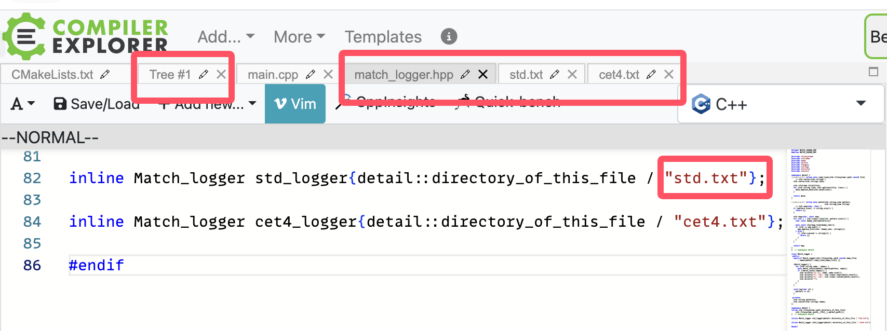

************************************************************************************************************************
制作更多习题
************************************************************************************************************************

你可以用 :godbolt:`GYzh5hW17` 制作更多习题: 填入不同的数字作为输出后, 程序将会根据最终输出匹配合适的单词, 并提示该怎么替换字符.

例如,

.. code-block:: cpp
  :linenos:

  int main() {
    Noisy c1{
        Info{.ctor = '0', .copy_ctor = '1', .copy_assign = '2', .dtor = '3'}};

    Noisy c2{
        Info{.ctor = '4', .copy_ctor = '5', .copy_assign = '6', .dtor = '7'}};

    Noisy c3 = c1;

    c3 = c2;
    c3 = c1;
  }

将会产生以下输出:

.. code-block:: text
  :linenos:

  analysis 8
  [ 0,  1,  2,  3,  4,  6,  7]
  [ a,  a,  y,  s,  n,  l,  i]

  anywhere 8
  [ 0,  1,  2,  3,  4,  6,  7]
  [ a,  y,  h,  e,  n,  w,  r]

  complete 8
  [ 0,  1,  2,  3,  4,  6,  7]
  [ c,  m,  l,  e,  o,  p,  t]

  concrete 8
  [ 0,  1,  2,  3,  4,  6,  7]
  [ c,  n,  r,  e,  o,  c,  t]

  emphasis 8
  [ 0,  1,  2,  3,  4,  6,  7]
  [ e,  p,  a,  s,  m,  h,  i]

  japanese 8
  [ 0,  1,  2,  3,  4,  6,  7]
  [ j,  p,  n,  e,  a,  a,  s]

  parallel 8
  [ 0,  1,  2,  3,  4,  6,  7]
  [ p,  r,  l,  l,  a,  a,  e]

  provided 8
  [ 0,  1,  2,  3,  4,  6,  7]
  [ p,  o,  i,  d,  r,  v,  e]

  splendid 8
  [ 0,  1,  2,  3,  4,  6,  7]
  [ s,  l,  n,  d,  p,  e,  i]

之后选择喜欢的一个匹配结果替换原来的数字字符即可.

注意到, 输出中并不包含某些数字. 这是因为这些数字实际没有被输出, 你可以将它改为任意字符作为干扰项.

如果需要添加自己的单词表, 请参考 match_logger.hpp 最后部分是如何定义 :cpp:`std_logger` 和 :cpp:`cet4_logger` 的, 并在 Tree 窗口中添加你的文本.

