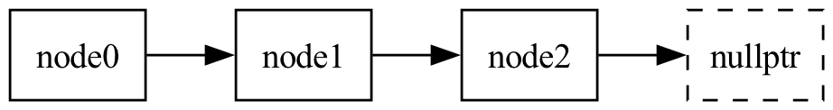
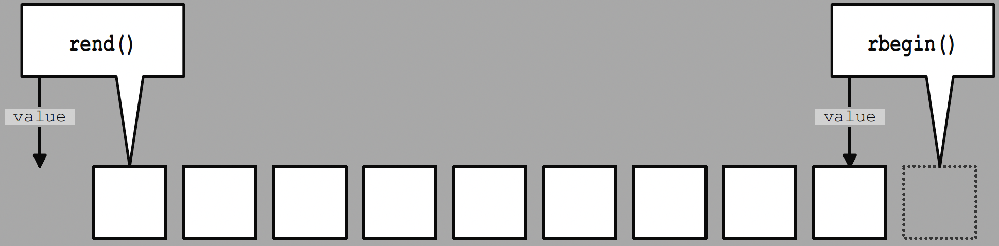

************************************************************************************************************************
范围、迭代器和算法 (range, iterator and algorithm)
************************************************************************************************************************

.. admonition:: 前置内容
  :class: precontent

  - :doc:`/faq/basic_concepts/auto`
  - :doc:`/faq/basic_concepts/c_array`
  - :doc:`/faq/basic_concepts/operator_overloading`
  - :doc:`/faq/basic_concepts/template`

========================================================================================================================
范围 (range)
========================================================================================================================

在 :doc:`/faq/basic_concepts/c_array` 中, 我留下了这样一段代码:

.. code-block:: cpp
  :linenos:

  void print(int const* begin, int const* end) {
    for (auto iter = begin; iter != end; ++iter) {
      std::cout << *iter << ' ';
    }
    std::cout << '\n';
  }

  int main() {
    int array[5] = {0, 1, 2, 3, 4};
    print(array + 1, array + 3);  // 输出 1 2
    print(array + 2, array + 5);  // 输出 2 3 4
  }

可以发现, 我们完全可以传入数组的一个子部分, 单独对那个部分进行操作. 这样由一个 *起始点* 和一个 *结束点* 描述的一部分 (一系列值的集合), 称为范围 (range).

在 C++ 中, 范围通常用半开区间 :cpp:`[begin, end)` 表示, 例如 :cpp:`print(array + 1, array + 3)` 即是传入范围 :cpp:`[array + 1, array + 3)`.

:cpp:`begin`
  指向范围中第一个元素.

:cpp:`end`
  指向范围中最后一个元素之后一个位置.

.. figure:: iteration.gif

我们可以用标准库里的函数, 让范围的传入更加直观:

.. code-block:: cpp
  :linenos:

  #include <iterator>
  using namespace std;

  int main() {
    int array[5] = {0, 1, 2, 3, 4};
    print(begin(array), end(array));            // 输出 0 1 2 3 4
    print(begin(array) + 2, begin(array) + 4);  // 输出 2 3
    print(begin(array) + 2, end(array) - 1);    // 输出 2 3
  }

========================================================================================================================
迭代器 (iterator)
========================================================================================================================

------------------------------------------------------------------------------------------------------------------------
概念 (concept)
------------------------------------------------------------------------------------------------------------------------

让我们分析一下我们是如何对范围进行访问的:

.. code-block:: cpp
  :linenos:

  void print(int const* begin, int const* end) {
    for (auto iter = begin; iter != end; ++iter) {
      std::cout << *iter << ' ';
    }
    std::cout << '\n';
  }

- 我们通过传入首指针和逾尾指针, 确定要访问的范围为 :cpp:`[begin, end)`.

- 在函数内, 我们用指针遍历:

  - 通过拷贝进行传参和 :cpp:`auto iter = begin`, 我们得到指向同一个元素的指针.

  - 通过相等性比较 :cpp:`iter != end`, 我们判断是否已经遍历到范围外.

  - 通过解引用操作 :cpp:`*iter`, 我们访问指针指向的当前元素.

  - 通过自增操作 :cpp:`++iter`, 我们获得下一个元素的指针.

那么, 如果我们自定义一个类型, 它包装一个指针从而支持所有这些操作, 将会怎么样?

首先, 我们让这个自定义类型 :cpp:`Iter` 存储一个指针:

.. literalinclude:: input_iterator.cpp
  :lines: 1-3, 22-25
  :dedent:
  :language: cpp
  :linenos:

然后, 我们使用运算符重载让 :cpp:`Iter` 支持上面所说的所有操作.

支持拷贝
  .. literalinclude:: input_iterator.cpp
    :lines: 4
    :dedent:
    :language: cpp
    :linenos:

支持相等性比较
  .. literalinclude:: input_iterator.cpp
    :lines: 6-12
    :dedent:
    :language: cpp
    :linenos:

支持解引用
  .. literalinclude:: input_iterator.cpp
    :lines: 14-16
    :dedent:
    :language: cpp
    :linenos:

支持自增操作
  .. literalinclude:: input_iterator.cpp
    :lines: 18-21
    :dedent:
    :language: cpp
    :linenos:

故迭代器 :cpp:`Iter` 的定义如下:

.. literalinclude:: input_iterator.cpp
  :dedent:
  :language: cpp
  :linenos:

自然地, 这个类型也可以用于范围的访问:

.. code-block:: cpp
  :linenos:

  void print(Iter begin, Iter end) {
    for (auto iter = begin; iter != end; ++iter) {
      std::cout << *iter << ' ';
    }
    std::cout << '\n';
  }

  int main() {
    int array[5] = {0, 1, 2, 3, 4};
    print(Iter(array + 1), Iter(array + 3));
  }

好吧, 指针和 :cpp:`Iter` 都支持这些操作……等等, 是不是有一种称为模板的特性, 可以为 *支持函数中所有操作的类型* 生成对应的函数?

.. code-block:: cpp
  :linenos:

  template <typename Iter>
  void print(Iter begin, Iter end) {
    for (auto iter = begin; iter != end; ++iter) {
      std::cout << *iter << ' ';
    }
    std::cout << '\n';
  }

  int main() {
    int array[5] = {0, 1, 2, 3, 4};
    print(array + 1, array + 3);                // 可以!
    print(begin(array) + 1, begin(array) + 3);  // 可以!
    print(Iter(array + 1), Iter(array + 3));    // 可以!
  }

.. margin::

  事实上, 我们很久以前就接触过概念了: :cpp:`short`、:cpp:`int`、:cpp:`long` 等都属于一个概念——整型 (integer).

如此, 我们从指针类型中抽象出了一个概念 (concept)——迭代器 (iterator).

一个类型只要支持迭代器概念的语义和操作, 我们就说它建模了 (models) 迭代器概念. 具体地, 对于 :cpp:`Iter` 类型的对象 :cpp:`i` 和 :cpp:`j`:

- 可以进行拷贝得到指向同一个元素的迭代器.
- 可以进行相等比较 :cpp:`i == j` 和 :cpp:`i != j`.
- 可以进行解引用操作 :cpp:`*i` 和 :cpp:`i->member`.
- 可以进行自增操作, 其中 :cpp:`++i` 应该返回自己的引用, 而 :cpp:`i++` 的返回值不作要求.

------------------------------------------------------------------------------------------------------------------------
单向链表的迭代器
------------------------------------------------------------------------------------------------------------------------

请不要被标题吓到, 我们在这里并不会探究链表的全部.

一个单向链表由多个结点 :cpp:`Node` 组成. 每个结点存储有值, 并能够找到下一个结点; 如果没有下一个结点, 则 :cpp:`next` 为空指针 :cpp:`nullptr`.

.. code-block:: cpp
  :linenos:

  struct Node {
   public:
    int value;   // 当前结点的值
    Node* next;  // 指向下一个结点的指针
  };

以下代码即构成了一个单向链表:

.. code-block:: cpp
  :linenos:

  int main() {
    Node node2 = {2, nullptr};
    Node node1 = {1, &node2};
    Node node0 = {0, &node1};
    // node0 -> node1 -> node2 -> nullptr
  }

由此我们可以编写单向链表的循环:

.. code-block:: cpp
  :linenos:

  void print(Node const* begin, Node const* end) {
    for (auto node = begin; node != end; node = node->next) {
      std::cout << node->value << ' ';
    }
    std::cout << '\n';
  }

注意到相比于迭代器代码, 单向链表的循环只存在以下区别:

- :cpp:`*iter` 变成了 :cpp:`node->value`.
- :cpp:`++iter` 变成了 :cpp:`node = node->next`.

那么我们自然能据此定义一个迭代器类型:

.. tabs::

  .. tab:: 核心代码

    .. literalinclude:: forward_list_iterator_simplified.cpp
      :emphasize-lines: 11, 15
      :language: cpp
      :linenos:

  .. tab:: 完整实现

    .. literalinclude:: forward_list_iterator.cpp
      :language: cpp
      :linenos:

于是, 这个迭代器可以直接使用我们定义好的 :cpp:`print` 函数:

.. code-block:: cpp
  :linenos:

  template <typename Iter>
  void print(Iter begin, Iter end) {
    for (auto iter = begin; iter != end; ++iter) {
      std::cout << *iter << ' ';
    }
    std::cout << '\n';
  }

  int main() {
    Node node2 = {2, nullptr};
    Node node1 = {1, &node2};
    Node node0 = {0, &node1};
    // node0 -> node1 -> node2 -> nullptr

    print(Forward_list_iterator(&node0),  // 输出 0 1 2
          Forward_list_iterator(&node2))
  }

========================================================================================================================
算法 (algorithm)
========================================================================================================================

------------------------------------------------------------------------------------------------------------------------
基于范围的 for 循环
------------------------------------------------------------------------------------------------------------------------

基于范围和迭代器的概念, C++11 起支持一种新的循环语法——基于范围的 for 循环.

简单而言, 它遍历整个范围中的元素:

.. code-block:: cpp
  :linenos:
  :caption: 基于范围的 for 循环

  int range[4] = {0, 1, 2, 3};

  for (auto const& value : range) {
    std::cout << value << ' ';
  }
  std::cout << '\n';

.. code-block:: cpp
  :linenos:
  :caption: 对应的一般循环

  int range[4] = {0, 1, 2, 3};

  auto begin = begin(range);
  auto end   = end(range);
  for (; begin != end; ++begin) {
    auto const& value = *begin;
    std::cout << value << ' ';
  }
  std::cout << '\n';

------------------------------------------------------------------------------------------------------------------------
具名算法
------------------------------------------------------------------------------------------------------------------------

同样基于范围和迭代器的概念, 标准库在 :cpp:`<algorithm>`、:cpp:`<numeric>` (和 :cpp:`<memory>`) 中定义了上百种算法.

例如, 要找到 :cpp:`[begin, end)` 中第一个等于 :cpp:`value` 的元素, 可以用 :cpp:`std::find`:

.. code-block:: cpp
  :linenos:

  #include <algorithm>
  #include <iostream>

  // 返回所找到元素的迭代器, 如果没找到, 返回 end 迭代器
  auto iter = std::find(begin(array), end(array), value);

  if (iter == end(array)) {  // 没找到
    std::cout << "Not found!\n";
  } else {
    std::cout << "Found " << *iter << "!\n";
  }

如果是要找到第一个偶数呢? :cpp:`std::find_if`:

.. code-block:: cpp
  :linenos:

  #include <algorithm>

  bool is_even(int value) {
    return value % 2 == 0;
  }

  auto iter = std::find_if(begin(array), end(array), is_even);

可能你不想把时间花在函数该放在哪里、该叫什么名字上面, 只是想进行查找, 则可以使用 Lambda 表达式:

.. code-block:: cpp
  :linenos:

  #include <algorithm>

  auto iter = std::find_if(begin(array),
                           end(array),
                           { return value % 2 == 0; });

相比于单纯的循环, 算法的名字会告诉读者代码做了什么:

.. tabs::

  .. tab:: 我看不出来你是想做什么

    .. code-block:: cpp
      :linenos:

      int index = 0;
      for (; index < size; ++index) {
        if (array[index] % 2 == 0) {
          break;
        }
      }

  .. tab:: 我一看就知道了

    .. code-block:: cpp
      :linenos:

      auto iter = std::find_if(begin(array),
                               end(array),
                               { return value % 2 == 0; });

当然, 上百种算法不止有查找, 但你已经掌握了算法如何使用, `需要时查询即可 <https://zh.cppreference.com/w/cpp/header/algorithm>`_.

.. seealso::

  - `105 STL Algorithms in Less Than an Hour - Jonathan Boccara - CppCon 2018`_ 一小时内概览 105 种 STL 算法 (已翻译).

========================================================================================================================
深入迭代器
========================================================================================================================

前面我们通过数组指针分析得到了迭代器概念, 利用迭代器概念设计单向链表的接口, 使数组和链表都能使用通用的 :cpp:`print` 算法.

接下来我们将设计更多的迭代器, 通过实践和观察发现迭代器概念的不同层级.

------------------------------------------------------------------------------------------------------------------------
:cpp:`cin` 迭代器
------------------------------------------------------------------------------------------------------------------------

有时候我们想要输入一些数据, 对每个输入内容单独进行操作, 再进行输出:

.. code-block:: cpp
  :linenos:

  template <typename T>
  void f() {
    while (true) {
      T value;
      cin >> value;
      if (cin.fail()) {  // 读入失败, 结束循环
        break;
      }

      auto result = process_value(value);

      cout << result << ' ';
    }
  }

让我们单独观察输入部分:

.. code-block:: cpp
  :linenos:
  :caption: 读入范围中下一个元素

  T value;
  cin >> value;

.. code-block:: cpp
  :linenos:
  :caption: 判断是否已经遍历到范围外

  if (cin.fail()) {
    break;
  }

.. code-block:: cpp
  :linenos:
  :caption: 使用元素

  auto result = process_value(value);

注意到,

- :cpp:`cin >> value` 可以对应于迭代器自增操作.
- :cpp:`cin.fail()` 可以对应于迭代器判断是否终止.
- 对 :cpp:`value` 的使用可以对应于迭代器解引用操作.

据此我们可以找到 :cpp:`cin` 的迭代器 :cpp:`Cin_iterator<T>` 的 **一种** 实现方式:

成员
  如果想让同一迭代器几次解引用返回的是同一对象, 我们需要将 :cpp:`T value_` 存储起来.

  .. code-block:: cpp
    :linenos:

    template <typename T>
    class Cin_iterator {
     public:
      /* ... */

     private:
      T value_;
    };

自增操作
  这意味着处理下一个输入.

  .. code-block:: cpp
    :linenos:

    Cin_iterator& operator++() {
      cin >> value_;
      return *this;
    }

解引用
  这意味着使用当前输入.

  .. code-block:: cpp
    :linenos:

    T const& operator*() const {
      return value_;
    }

相等比较
  对于此处设计的 :cpp:`cin` 迭代器, 相等比较的唯一目的是判断 :cpp:`begin == end` 是否成立, 这是通过判断 :cpp:`cin` 是否读取失败而不能继续读取, 即 :cpp:`cin.fail()` 是否为 :cpp:`true` 来获得的.

  但 :cpp:`cin.fail()` 跟我们当前迭代器所存储的 :cpp:`T value_` 没有任何关系, 使用另外的类型来表达这样的判断会更加清晰:

  .. code-block:: cpp
    :linenos:

    friend bool operator==(Cin_iterator const&,
                           Cin_end_iterator const&) {
      return cin.fail();
    }
    friend bool operator==(Cin_end_iterator const& lhs,
                           Cin_iterator const& rhs) {
      return rhs == lhs;
    }

  遗憾的是, C++20 以前要求表示范围的 :cpp:`begin` 和 :cpp:`end` 类型必须相同:

  .. code-block:: cpp
    :linenos:

    friend bool operator==(Cin_iterator const&,
                           Cin_iterator const&) {
      return cin.fail();
    }

构造函数
  我们选择自增操作时读取下一个输入, 解引用时直接返回 :cpp:`value_`, 这意味着如果我们构造迭代器时不管不顾, 则以下代码存在问题:

  .. code-block:: cpp
    :emphasize-lines: 2
    :linenos:

    Cin_iterator<int> iter;
    cout << *iter;  // 输出什么?

    ++iter;         // 这里才 cin >> value_;
    cout << *iter;  // 输出刚刚输入的 value_
    cout << *iter;  // 输出刚刚输入的 value_

  为此, 我们可以自定义默认构造函数, 在默认构造函数中输入数据:

  .. code-block:: cpp
    :emphasize-lines: 5
    :linenos:

    template <typename T>
    class Cin_iterator {
     public:
      Cin_iterator() : value_() {
        cin >> value;
      }

     private:
      T value_;
    };

  .. hint::

    你也可以修改解引用和自增操作的实现来修复这个问题, 无论怎么实现, 只要能建模迭代器概念就是迭代器.

  但这带来新的问题: 我们是用两个迭代器 :cpp:`[begin, end)` 来表示范围的, 而 :cpp:`end` 的默认构造函数也会读入一个数据. 也就是说, 当我们读入 :cpp:`0 1 2 3` 时, :cpp:`begin` 和 :cpp:`end` 将分别读入 :cpp:`0` 和 :cpp:`1`, 而由于 :cpp:`end` 仅仅用于逾尾判断不会被解引用, 我们在构造 :cpp:`end` 迭代器时, 就丢失了这个数据.

  .. code-block:: cpp
    :linenos:

    /* 输入 0 1 2 3 */

    Cin_iterator begin;  // 读入 0
    Cin_iterator end;    // 读入 1
    print(begin, end);   // 输出 0 2 3!

  因此我们需要为 :cpp:`begin` 和 :cpp:`end` 进行不同的构造:

  .. code-block:: cpp
    :linenos:

    template <typename T>
    class Cin_iterator {
     public:
      Cin_iterator(bool is_end) : value_() {
        if (!is_end) {
          cin >> value;
        }
      }

     private:
      T value_;
    };

  .. code-block:: cpp
    :linenos:

    print(Cin_iterator<int>(false), Cin_iterator<int>(true));

  .. admonition:: 别看: 其他构造 :cpp:`begin` 和 :cpp:`end` 的方案
    :class: dontread, dropdown

    .. tabs::

      .. tab:: 标签分发 (tag dispatch) 惯用法

        .. code-block:: cpp
          :linenos:

          struct begin_tag {};
          struct end_tag {};
 
          template <typename T>
          class Cin_iterator {
           public:
            Cin_iterator(begin_tag) : value_() {
              cin >> value;
            }
            Cin_iterator(end_tag) : value_() {}

           private:
            T value_;
          };

        .. code-block:: cpp
          :linenos:

          print(Cin_iterator<int>(begin_tag()), Cin_iterator<int>(end_tag()));

      .. tab:: 具名构造函数 (named constructor) 惯用法

        .. code-block:: cpp
          :linenos:

          template <typename T>
          class Cin_iterator {
           public:
            static Cin_iterator begin() {
              Cin_iterator iter;
              cin >> iter.value_;
              return iter;
            }
            static Cin_iterator end() {
              return Cin_iterator();
            }

           private:
            Cin_iterator() {}  // 仅允许私用

            T value_;
          };

        .. code-block:: cpp
          :linenos:

          print(Cin_iterator<int>::begin(), Cin_iterator<int>::end());

故 :cpp:`cin` 的迭代器定义如下:

.. literalinclude:: cin_iterator.cpp
  :language: cpp
  :linenos:

需要注意的是, 由于我们规定 :cpp:`cin.fail()` 成立时范围终止, 我们需要通过 Windows 下 :KBD:`Ctrl` + :KBD:`z`, MacOS 下 :KBD:`Ctrl` + :KBD:`d`, 或输入错误数据的方式来终止范围. **无论如何, 我们确实成功为输入制作了迭代器!**

.. code-block:: cpp
  :linenos:

  print(Cin_iterator<int>(false), Cin_iterator<int>(true));

你可以发现 :cpp:`cin` 迭代器和数组指针之间的明显区别:

.. code-block:: cpp
  :emphasize-lines: 4
  :linenos:
  :caption: 数组指针

  int array[5] = {0, 1, 2, 3, 4};

  auto i = begin(array);
  auto j = i;  // 拷贝当前迭代器

  std::cout << *i;  // 输出 0
  ++i;
  std::cout << *i;  // 输出 1

  std::cout << *j;  // 输出 0
  ++j;
  std::cout << *j;  // 也输出 1

.. code-block:: cpp
  :emphasize-lines: 4
  :linenos:
  :caption: :cpp:`cin` 迭代器

  /* 输入 0 1 2 3 4 */

  Cin_iterator i(false);  // 读入 0
  Cin_iterator j(i);      // 拷贝当前迭代器

  std::cout << *i;  // 输出 0
  ++i;              // 读入 1
  std::cout << *i;  // 输出 1

  std::cout << *j;  // 输出 0
  ++j;              // 读入 2
  std::cout << *j;  // 输出 2

当 :cpp:`cin` 迭代器进行自增操作后, 之前拷贝它所得到的新迭代器出现奇怪的行为, 这是与 :cpp:`cin` 和 :cpp:`cout` 的特点相符的:

- 每次通过 :cpp:`cin >> value` 读入数据后, 再次以 :cpp:`cin >> value` 读入将会得到之后的数据, 而数据就这样确实输入了, 很难有办法进行撤销.
- 每次通过 :cpp:`cout << value` 输出数据后, 再次以 :cpp:`cout << value` 输出将会输出别的数据, 而数据就这样确实输出了, 很难有办法进行撤销.

这就像水流一样覆水难收, 因而我们称 :cpp:`cin` 和 :cpp:`cout` 为输入流、输出流 (stream).

.. epigraph::

  人不能两次踏进同一条河流.

  —— 古希腊哲学家赫拉克利特

------------------------------------------------------------------------------------------------------------------------
反向迭代器
------------------------------------------------------------------------------------------------------------------------

:cpp:`std::find` 算法是从左到右找到第一个满足的元素, 但有时我们需要最右边一个满足的元素. 我们接下来定义一个反向迭代器 :cpp:`Reverse_iterator`, 它从右到左反向地迭代整个范围.

为完成反向, 范围 :cpp:`[begin, end)` 对应于新的范围 :cpp:`[rbegin, rend)`, 则如图所示:

  范围和反向范围的对应关系 [#1]_

.. [#1] 引用自《C++ Standard Library, 2nd Edition》

- :cpp:`begin` 对应于 :cpp:`rend`.
- :cpp:`end` 对应于 :cpp:`rbegin`.
- :cpp:`*iter` 解引用应该访问上一个元素.
- :cpp:`++iter` 自增应该得到上一个元素的迭代器.

据此我们可以找到迭代器 :cpp:`iter` 的反向迭代器的 **一种** 实现方式:

数据成员
  原本的迭代器 :cpp:`iter`.

相等比较
  .. code-block:: cpp
    :linenos:

    friend bool operator==(Reverse_iterator const& lhs,
                           Reverse_iterator const& rhs) {
      return lhs.iter_ == rhs.iter_;
    }

解引用
  .. code-block:: cpp
    :linenos:

    auto const& operator*() const {
      auto temp = iter_;
      --temp;  // 解引用应该访问上一个元素
      return *temp;
    }

自增操作
  .. code-block:: cpp
    :linenos:

    Reverse_iterator& operator++() {
      --iter_;  // 自增应该得到上一个元素的迭代器
      return *this;
    }

故迭代器 :cpp:`iter` 的反向迭代器定义如下:

.. tabs::

  .. tab:: 核心代码

    .. literalinclude:: reverse_iterator_simplified.cpp
      :emphasize-lines: 12-14, 23
      :language: cpp
      :linenos:

  .. tab:: 完整实现

    .. literalinclude:: reverse_iterator.cpp
      :language: cpp
      :linenos:

于是, 这个迭代器可以直接使用我们定义好的 :cpp:`print` 函数:

.. code-block:: cpp
  :linenos:

  int array[5] = {0, 1, 2, 3, 4};
  print(make_reverse_iterator(end(array)),  // 输出 4 3 2 1 0
        make_reverse_iterator(begin(array)));

但请注意看我们的实现:

.. literalinclude:: reverse_iterator_simplified.cpp
  :lines: 22-25
  :emphasize-lines: 2
  :language: cpp
  :linenos:

我们使用了 :cpp:`--iter`! 也就是说, 要能生成反向迭代器, 要求使用的迭代器不仅支持向前的 :cpp:`++iter` 自增操作, 也要支持向后的 :cpp:`--iter` 自减操作.

------------------------------------------------------------------------------------------------------------------------
迭代器和下标的区别?
------------------------------------------------------------------------------------------------------------------------

迭代器指向的位置是绝对的, 下标指向的位置是相对的.

以 :cpp:`std::find` 为例. 对于迭代器表示法, 要查找一个子范围则直接查找即可:

.. code-block:: cpp
  :emphasize-lines: 14, 16
  :linenos:

  template <typename Iter, typename T>
  Iter find(Iter begin, Iter end, T const& value) {
    for (; begin != end; ++begin) {
      if (*begin == value) {
        return begin;
      }
    }
    return begin;
  }

  int main() {
    int array[5] = {0, 1, 2, 3, 4};

    auto iter = find(begin(array) + 1, begin(array) + 4, 3);
    if (iter != begin(array) + 4) {
      std::cout << *iter;  // 无论如何, 这就是找到的元素😋
    }
  }

可是下标呢? 当我们传入子范围, 所得到的下标 :cpp:`0` 是相对于这个子范围而言的:

.. code-block:: cpp
  :emphasize-lines: 15, 17
  :linenos:

  template <typename T>
  int find(T const* array, int size, T const& value) {
    int i = 0;
    for (; i != size; ++i) {
      if (array[i] == value) {
        return i;
      }
    }
    return i;
  }

  int main() {
    int array[5] = {0, 1, 2, 3, 4};

    int index = find(array + 1, 3, 1);
    if (index != 3) {
      // index == 0, 它对应的是 (array + 1)[0], 也就是 array[1]!😩
    }
  }

下标是相对的, 这意味着它不能很好地处理单向链表等数据结构. 毕竟, 我们该如何得到第 3 个结点? 我们只能从第 1 个结点慢慢数过去:

.. code-block:: cpp
  :linenos:

  Node* operator {
    for (int i = 0; i < index; ++i) {  // 循环!
      if (node == nullptr) {
        return nullptr;
      }
      node = node->next;
    }
    return node;
  }

那么单向链表的一次遍历, 需要计算多少次?

.. tabs::

  .. tab:: 迭代器

    .. code-block:: text
      :linenos:

      node[0]: node[0]
               ↓
      node[1]: node[1]
               ↓
      node[2]: node[2]
               ↓
      ...
               ↓
      node[n]: node[n]

  .. tab:: 下标

    .. code-block:: text
      :linenos:

      node[0]: node[0]
      node[1]: node[0]->node[1]
      node[2]: node[0]->node[1]->node[2]
      ...
      node[n]: node[0]->node[1]->...->node[n]

可是下标确实存在优势, 我们可以进行 :cpp:`i < j` 比较, 可以 :cpp:`i + 5` 直接得到对应的下标……但仔细想想, 指针不也能做到这些事吗?

.. code-block:: cpp
  :linenos:

  int main() {
    int array[5] = {0, 1, 2, 3, 4};
    int* lhs     = begin(array) + 1;
    int* rhs     = lhs + 2;
    std::cout << rhs[1];  // 输出 4
  }

------------------------------------------------------------------------------------------------------------------------
不同层次的迭代器
------------------------------------------------------------------------------------------------------------------------

我们目前已经设计和发现了 4 种建模了迭代器概念的类型, 但它们在建模迭代器概念的同时, 存在明显的差异:

:cpp:`cin` 迭代器 :cpp:`Cin_iterator<T>`
  它只能进行自增操作 :cpp:`++iter`. 当它进行自增操作后, 之前拷贝它所得到的新迭代器出现奇怪行为, 所以它只支持向右单次遍历.

单向链表迭代器 :cpp:`Forward_list_iterator`
  它只能进行自增操作 :cpp:`++iter`. 当它进行自增操作后, 之前拷贝它所得到的新迭代器行为保持正常, 所以它支持向右多次遍历.

反向迭代器 :cpp:`Reverse_iterator<Iter>`
  它要求包装的原迭代器 :cpp:`Iter` 支持自减操作 :cpp:`--iter`, 所以 :cpp:`Iter` 既支持向右多次遍历, 又支持向左多次遍历.

指针
  它不仅能够自增自减、相等比较, 还能

  - :cpp:`iter_i < iter_j` 进行偏序比较.
  - :cpp:`iter + n` 和 :cpp:`iter - n` 快速得到对应的迭代器.
  - :cpp:`iter_j - iter_i` 快速得到迭代器间的距离.
  - :cpp:`iter[n]` 快速进行下标访问.

难道我们要忽略这些差异吗?

现在假设我们要设计一个算法 :cpp:`find_last`, 对于一个范围, 它找到最右边一个满足条件的元素 (假设必然能找到), 则根据这些迭代器的差异, 我们可以编写不同效率的算法:

.. tabs::

  .. tab:: 指针和反向迭代器

    .. code-block:: cpp
      :linenos:

      template <typename Iter, typename T>
      Iter find_last(Iter begin, Iter end, T const& value) {
        return std::find(make_reverse_iterator(begin),
                         make_reverse_iterator(end),
                         value);
      }

  .. tab:: 单向链表迭代器

    .. code-block:: cpp
      :linenos:

      template <typename Iter, typename T>
      Iter find_last(Iter begin, Iter end, T const& value) {
        Iter found;
        for (auto iter = begin; iter != end; ++iter) {
          if (*iter == value) {
            found = iter;
          }
        }
        return found;
      }

  .. tab:: :cpp:`cin` 迭代器

    这不可能做到.

    :cpp:`cin` 迭代器只能向右遍历, 而当找到满足条件的元素时, 我们不能确定它就是最右边的元素, 必须继续向右遍历. 由于发生自增操作, 之前保存的满足条件元素的迭代器出现奇怪行为, 我们不敢保证正确性.

可见, 这些差异确实对我们的算法设计产生了影响, 我们需要接受这样的差异.

你听说过整型吗? :cpp:`int`、:cpp:`unsigned int`、:cpp:`long` 等都建模了整型概念.

你听说过有符号整型吗? :cpp:`int`、:cpp:`long` 等建模了有符号整型概念. 所有建模有符号整型概念的类型, 都建模了整型概念, 我们称之为有符号整型概念精化 (refine) 了整型概念.

我们同样可以对迭代器概念进行精化, 简单而言:

输入迭代器 (input iterator)
  它建模了迭代器概念, 此外:

  - 它只保证单次遍历的有效性: 一旦迭代器发生自增操作, 那么所有之前拷贝它得到的迭代器都可能会失效.

前向迭代器 (forward iterator)
  它建模了输入迭代器概念, 此外:

  - 它保证多次遍历的有效性: 迭代器发生自增操作不影响之前拷贝它得到的迭代器.

双向迭代器 (bidirectional iterator)
  它建模了前向迭代器概念, 此外:

  - 它既能自增, 又能自减.

随机访问迭代器 (random access iterator)
  它建模了双向迭代器概念, 此外:

  - 它能通过 :cpp:`iter_i < iter_j` 进行偏序比较.
  - 它能通过 :cpp:`iter + n` 和 :cpp:`iter - n` 快速得到对应的迭代器.
  - 它能通过 :cpp:`iter_rhs - iter_lhs` 快速得到迭代器间的距离.
  - 它能通过 :cpp:`iter[n]` 快速进行下标访问.

========================================================================================================================
深入范围
========================================================================================================================

------------------------------------------------------------------------------------------------------------------------
为什么是半开区间?
------------------------------------------------------------------------------------------------------------------------

我们从数学上了解到三种区间: 半开区间 :cpp:`[begin, end)`、闭区间 :cpp:`[begin, end]`、开区间 :cpp:`(begin, end)`.
为什么 C++ 用半开区间表示范围呢?

半开区间很适合作为接口.
  n 个元素的算法可能用到 n + 1 可能位置, 例如插入算法:

  .. figure:: insert.png

    插入算法存在 n + 1 个插入位置

半开区间直接支持表示空范围.
  当半开区间 :cpp:`[begin, end)` 满足 :cpp:`begin == end` 时, 即表示范围为空; 而闭区间、开区间均难以做到, 必须用特殊的值来表示范围为空.

  此外, 半开区间不仅能直接描述范围为空, 还能指明空范围的位置, 从而指出如果需要插入等操作应该在哪里进行:

  .. figure:: insert_empty.png

    空范围的插入位置

.. hint::

  数组下标为什么从 :cpp:`0` 开始? :cpp:`[0, size)` 半开区间表示了数组构成的范围.

========================================================================================================================
深入算法
========================================================================================================================

------------------------------------------------------------------------------------------------------------------------
更多算法示例
------------------------------------------------------------------------------------------------------------------------

.. seealso::

  - `105 STL Algorithms in Less Than an Hour - Jonathan Boccara - CppCon 2018`_ 一小时内概览 105 种 STL 算法 (已翻译).
  - `cppreference: algorithm`_

.. tabs::

  .. tab:: 相等比较

    :godbolt:`6TfK5W1oa`

    .. code-block:: cpp
      :linenos:

      // 比较 [begin1, end1) 和 [begin2, begin2 + (end1 - begin1)) 是否相等
      bool is_equal = std::equal(begin(range1), end(range1),
                                 begin(range2));

      // 平方相等
      bool is_equal = std::equal(begin(range1), end(range1),
                                 begin(range2),
                                  {
                                   return lhs * lhs == rhs * rhs;
                                 });

  .. tab:: 排序

    :godbolt:`W1xhEErx1`

    .. code-block:: cpp
      :linenos:

      // 以非降序排序 [begin, end)
      std::sort(begin(range), end(range));

      // 以非升序排序 [begin, end)
      std::sort(begin(range), end(range),
                 { return lhs > rhs; });

  .. tab:: 计数

    :godbolt:`rEWbcncbr`

    .. code-block:: cpp
      :linenos:

      // 计数有多少个 3
      int count = std::count(begin(range), end(range), 3);

      // 计数有多少个偶数
      int count = std::count_if(begin(range), end(range),
                                 { return value % 2 == 0; });

  .. tab:: 最值

    :godbolt:`rK1vh637o`

    .. code-block:: cpp
      :linenos:

      // 返回找到元素的迭代器, 如果有多个最值元素, 返回最左边一个
      auto iter = std::max_element(begin(range), end(range));
      auto iter = std::min_element(begin(range), end(range));

      // 当然同样可以自定义最值的比较方式
      auto iter  = std::max_element(begin(range), end(range)
                             { return lhs * lhs < rhs * rhs; });
      auto iter  = std::min_element(begin(range), end(range)
                             { return lhs * lhs < rhs * rhs; });

  .. tab:: 反转

    :godbolt:`EGqzx8srW`

    .. code-block:: cpp
      :linenos:

      int range[4] = {0, 1, 2, 3};

      // 反转范围中的元素: [begin, end) -> [end, begin)
      std::reverse(begin(range), end(range));

      print(begin(range), end(range));  // 输出 3 2 1 0

  .. tab:: 划分

    :godbolt:`fPsjYsf33`

    .. code-block:: cpp
      :linenos:

      int range[5] = {0, 1, 2, 3, 4};

      // 将满足条件的元素排到范围左边, 不满足条件的排到范围右边
      auto iter = std::partition(begin(range), end(range),
                                  { return value % 2 == 0; } );
      print(begin(range), iter);  // 可能输出 0 2 4, 具体顺序不确定
      print(iter, end(range));    // 可能输出 1 3,   具体顺序不确定

  .. tab:: 第 n 小

    :godbolt:`6Maa8r8TP`

    .. code-block:: cpp
      :linenos:

      int range[5] = {9, 6, 2, 4, 3};

      // 对 [begin, end) 进行重排, 使得
      //  - iter 所指向的元素变成如果进行排序, iter 位置应该出现的元素, 即第 n 小元素
      //  - [begin, iter) 均小于或等于 *iter, 但具体顺序不确定
      //  - [iter, end) 均大于或等于 *iter, 但除 *iter 外具体顺序不确定
      auto iter = begin(range) + 2;
      std::nth_element(begin(range), iter, end(range));

      print(begin(range), iter);  // 可能输出 2 3, 具体顺序不确定
      print(iter, end(range));    // 可能输出 4 6 9, 除 4 外具体顺序不确定

  .. tab:: 旋转

    :godbolt:`v8Gn361Gd`

    .. code-block:: cpp
      :linenos:

      int range[5] = {0, 1, 2, 3, 4};

      // 左旋转范围中的元素: [begin, mid) + [mid, end) -> [mid, end) + [begin, mid)
      std::rotate(begin(range), begin(range) + 2, end(range));

      print(begin(range), end(range));  // 输出 2 3 4 0 1

    .. figure:: thats_a_rotate.gif

      `C++ Seasoning - Sean Parent - GoingNative 2013`_

------------------------------------------------------------------------------------------------------------------------
判断回文字符串
------------------------------------------------------------------------------------------------------------------------

回文字符串是一个正读和反读都一样的字符串, 比如 "level" 或者 "noon" 等等就是回文字符串.

好吧, 正读和反读都一样:

.. code-block:: cpp
  :linenos:

  template <typename Bidirectional_iter>
  bool is_palindrome(Bidirectional_iter begin, Bidirectional_iter end) {
    return std::equal(begin, end, make_reverse_iterator(end));
  }

------------------------------------------------------------------------------------------------------------------------
为什么不返回 -1?
------------------------------------------------------------------------------------------------------------------------

你可能会想, :cpp:`std::find` 没找到元素为什么不直接返回 -1 之类的特殊值表示?

教学里用下标时, 可能确实这么教过:

.. code-block:: cpp
  :linenos:

  int find(int const* array, int size, int value) {
    for (int i = 0; i < size; ++i) {
      if (array[i] == value) {
        return i;
      }
    }
    return -1;
  }

但这实际上丢失了信息 [#2]_.

.. [#2] 出自 `STL and Its Design Principles - Alexander Stepanov`_, STL——也就是此处涉及的所有内容和其他更多——的主要创造者的演讲.

当我们返回 :cpp:`end`, 我们不仅告知了没有找到, 还告知了接下来该从哪开始查找. 例如, 假设我们要查找范围中 **所有** :cpp:`3`:

.. code-block:: cpp
  :linenos:

  for (auto iter = find(begin(range), end(range), 3);
       iter != end;
       iter = find(++iter, end(range), 3)) {
    /* 范围内找到的所有 3 */
  }

.. hint::

  上面这个函数体现了一条重要的编程原则, 这就是有用的返回值原则 (The Law of Useful Return) [#3]_.

  .. [#3] 出自《From Mathematics to Generic Programming》, 也就是此处涉及的所有内容和其他更多的主要创造者的书.

  如果得到了有用的结果, 那就别把它扔掉, 而是应该将其返回给调用者.

  这样做可以令调用者 "顺便" 完成其他一些运算, 或是把数据存起来, 以供将来调用该函数的时候使用 (例如上面那样用 :cpp:`std::find()` 继续查找).

  然而并不是所有的地方都遵循这条原则, 比方说, 尽管当前很多处理器都能通过同一条指令来算出商和余数, 但是起初的 C 语言及 C++ 语言却依然用了两个不同的操作符来表示除法及求余运算, 这导致程序员无法通过同一次操作获取这两项结果. 后来, C++ 语言用 :cpp:`std::div()` 函数解决了这个问题.

------------------------------------------------------------------------------------------------------------------------
用不同层次的迭代器定义算法
------------------------------------------------------------------------------------------------------------------------

.. admonition:: 前置内容
  :class: precontent

  :doc:`/faq/virtual_function_invocation_explain/main`

通过对迭代器概念进行精化, 我们可以为合适的概念层次实现高效的算法. 但如何告知函数我们的类型能建模哪种迭代器概念呢? 例如:

.. code-block:: cpp
  :emphasize-lines: 1, 9
  :linenos:

  // 双向迭代器版本
  template <typename Iter, typename T>
  Iter find_last(Iter begin, Iter end, T const& value) {
  }

  // 前向迭代器版本
  template <typename Iter, typename T>
  Iter find_last(Iter begin, Iter end, T const& value) {
    // 错误: 不能重复定义!
  }

我们的需求是:

- 允许函数对不同迭代器类型进行区分定义.
- 为迭代器调用最精化概念的实现 (如果对上面的代码传入随机访问迭代器, 则应该调用双向迭代器版本).

我们可以使用标签分发 (tag dispatch) 惯用法, 利用类层次的特点来做到:

.. code-block:: cpp
  :linenos:

  struct input_iterator_tag {};
  struct forward_iterator_tag       : public input_iterator_tag {};
  struct bidirectional_iterator_tag : public forward_iterator_tag {};
  struct random_access_iterator_tag : public bidirectional_iterator_tag {};

  template <typename Iter, typename T>
  Iter find_last_impl(Iter begin, Iter end,
                      T const& value,
                      bidirectional_iterator_tag) {
    /* 双向迭代器版本的实现 */
  }

  template <typename Iter, typename T>
  Iter find_last_impl(Iter begin, Iter end,
                      T const& value,
                      forward_iterator_tag) {
    /* 前向迭代器版本的实现 */
  }

而自定义的类型应该以某种方式记录自己所建模的迭代器层次:

.. code-block:: cpp
  :linenos:

  class Iter {
   public:
    using iterator_category = random_access_iterator_tag;
  };

则 :cpp:`find_last` 定义为:

.. code-block:: cpp
  :linenos:

  template <typename Iter, typename T>
  Iter find_last(Iter begin, Iter end, T const& value) {
    return find_last_impl(begin, end, value, Iter::iterator_category());
  }

注意到, 我们传入了 :cpp:`Iter::iterator_category()`, 其类型为 :cpp:`random_access_iterator_tag`, 则 :cpp:`find_last_impl` 将根据其类层次选择最下层的 tag 进行调用: (具体原理基于重载决议 (overload resolution))

.. code-block:: text
  :linenos:

  input_iterator_tag
  ↑
  forward_iterator_tag
  ↑
  bidirectional_iterator_tag
  ↑
  random_access_iterator_tag

此处即调用 :cpp:`bidirectional_iterator_tag` 版本.

========================================================================================================================
关于迭代器的设计
========================================================================================================================

考虑到你可能没学习链表, 本解释中我先通过数组和指针给出了迭代器概念, 再用链表强调迭代器概念, 这看起来好像迭代器概念凭空而来, 又恰好能用于链表.
 
但请不要误会, 《Elements of Programming》(《编程原本》) 和 `STL and Its Design Principles - Alexander Stepanov`_ 都明确解释了, 各种概念是根据对大量已有数据结构和算法的观察才抽象出来的. 也就是说先有了对数组、链表等等数据结构的观察, 才抽象出了迭代器概念, 而这种精心设计的概念基于数学理论能应用于更多方面——这与抽象代数从其他数学领域中抽象得到是相通的.

其他语言也存在迭代器, `但 C++ 的迭代器与它们来自不同的概念 <https://www.jmeiners.com/efficient-programming-with-components/09_iterators.html>`_.

.. epigraph::

  我们的迭代器是对数据结构中坐标的一种泛化, 是一种轻量级的东西: 它不做任何事情, 只是指向某些东西.

  —— Alexander Stepanov `《Efficient Programming with Components》`_

========================================================================================================================
涉及的标准库内容
========================================================================================================================

------------------------------------------------------------------------------------------------------------------------
单向链表的迭代器
------------------------------------------------------------------------------------------------------------------------

标准库在 :cpp:`<forward_list>` 中定义了单向链表:

.. code-block:: cpp
  :linenos:

  #include <forward_list>
  #include <iterator>
  using namespace std;

  int main() {
    std::forward_list<int> list = {0, 1, 2, 3, 4};
    print(begin(list), end(list));
  }

实际上, 标准库为 C 风格数组、所有 STL 容器和其他一些类均定义有迭代器接口.

------------------------------------------------------------------------------------------------------------------------
:cpp:`cin` 迭代器
------------------------------------------------------------------------------------------------------------------------

这实际上是标准库中已有的类模板 :cpp:`std::istream_iterator<T>`.

.. code-block:: cpp
  :linenos:

  #include <iostream>
  #include <iterator>
  using namespace std;

  int main() {
    int array[5] = {0, 1, 2, 3, 4};
    print(std::istream_iterator<int>(std::cin), std::istream_iterator<int>())
  }

------------------------------------------------------------------------------------------------------------------------
反向迭代器
------------------------------------------------------------------------------------------------------------------------

这实际上是标准库中已有的类模板 :cpp:`std::reverse_iterator<Iter>`.

.. code-block:: cpp
  :linenos:

  #include <iterator>
  using namespace std;

  int main() {
    int array[5] = {0, 1, 2, 3, 4};
    print(std::make_reverse_iterator(end(array)),
          std::make_reverse_iterator(begin(array)));
  }

------------------------------------------------------------------------------------------------------------------------
用不同层次的迭代器定义算法
------------------------------------------------------------------------------------------------------------------------

C++17 及以前, 标准库即通过标签分发或其他各种方式实现 STL 算法.

.. code-block:: cpp
  :linenos:

  class Iter {
   public:
    using iterator_category = bidirectional_iterator_tag;
  };

对应的迭代器层次由 :cpp:`std::iterator_traits<Iter>::iterator_category` 得到:

.. code-block:: cpp
  :linenos:

  template <typename Iter, typename T>
  Iter find_last(Iter begin, Iter end, T const& value) {
    return find_last_impl(begin, end,
                          value,
                          std::iterator_traits<Iter>::iterator_category());
  }

------------------------------------------------------------------------------------------------------------------------
概念
------------------------------------------------------------------------------------------------------------------------

经过二十几年的设计权衡, C++20 正式引入了概念 (concepts), 这让算法定义非常容易:

.. code-block:: cpp
  :emphasize-lines: 5, 11
  :linenos:

  #include <iterator>
  using namespace std;

  template <typename Iter, typename T>
    requires std::bidirectional_iterator<Iter>
  Iter find_last(Iter begin, Iter end, T const& value) {
    /* ... */
  }

  template <typename Iter, typename T>
    requires std::forward_iterator<Iter>
  Iter find_last(Iter begin, Iter end, T const& value) {
    /* ... */
  }

------------------------------------------------------------------------------------------------------------------------
迭代器层次的定义
------------------------------------------------------------------------------------------------------------------------

C++17 及以前, C++ 标准用文字描述了这些迭代器概念的 `具名要求 <https://zh.cppreference.com/w/cpp/iterator>`_.

.. margin::

  例如原来要求 :cpp:`begin` 和 :cpp:`end` 必须是同一类型, 而现在针对范围不再作这样的强制要求.

C++20 及以后, 不同层次的迭代器便直接定义为 `代码可用的概念 <https://zh.cppreference.com/w/cpp/iterator#.E8.BF.AD.E4.BB.A3.E5.99.A8.E6.A6.82.E5.BF.B5_.28C.2B.2B20_.E8.B5.B7.29>`_, 并进行了一些调整; 而原来的具名要求称为 `Cpp17Iterator <https://eel.is/c++draft/iterator.cpp17>`_ 或 `LegacyIterator <https://zh.cppreference.com/w/cpp/iterator>`_.

========================================================================================================================
扩展阅读
========================================================================================================================

- :ref:`个人学习大纲: 基础部分 <学习大纲_基础>`

  - `105 STL Algorithms in Less Than an Hour - Jonathan Boccara - CppCon 2018`_ 一小时内概览 105 种 STL 算法 (已翻译).

  - `C++ Seasoning - Sean Parent - GoingNative 2013`_

- :ref:`个人学习大纲: 泛型编程部分 <学习大纲_泛型编程>` 所有内容.
