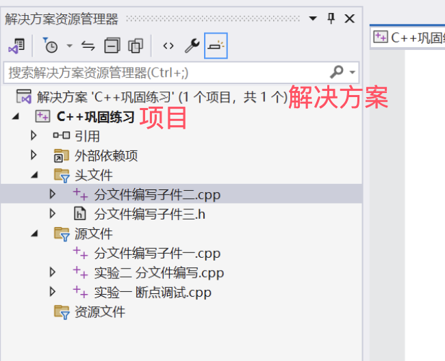

************************************************************************************************************************
:cpp:`main` 已经在 xxx.obj 中定义
************************************************************************************************************************

========================================================================================================================
解决方案
========================================================================================================================

**强烈建议** 直接配置 :ref:`VSCode (Windows/MacOS/Linux 均可用) <vscode_cpp_starter:main>` 或 :ref:`在 Visual Studio (Windows 可用) 中使用我给的学习模板 <vscode_cpp_starter:vs>`.

不需重新配置的解决方案见解释.

========================================================================================================================
解释
========================================================================================================================

Visual Studio 的每个项目对应于一个可执行程序 (executable). 可执行程序以 :cpp:`main` 函数作为运行的入口, 因此一个程序仅有且必须有一个 :cpp:`main` 函数. 换句话说, 你 **不能** 在一个项目里有多个 :cpp:`main` 函数, 而只能新建一个项目.

当然, Visual Studio 的每个解决方案下 (solution, 即 .sln 文件) 可以有多个项目, 因此你可以将多个项目添加到一个解决方案中, 便于学习很多代码. 但这样做的学习体验不如直接配置 :ref:`VSCode (Windows/MacOS/Linux 均可用) <vscode_cpp_starter:main>` 或 :ref:`在 Visual Studio (Windows 可用) 中使用我给的学习模板 <vscode_cpp_starter:vs>`.

  解决方案资源管理器
