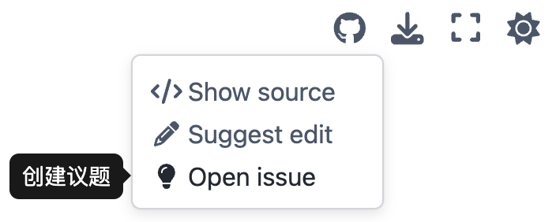

************************************************************************************************************************
遇到问题?
************************************************************************************************************************

========================================================================================================================
关于 C++ 的问题
========================================================================================================================

你可以,

- 加 QQ 群 682132891 提问.
- 在 `cpp_tutorial/question`_ 新建一个 `提问 <https://gitee.com/cpp_tutorial/question/issues/new/choose>`_.

========================================================================================================================
关于文档内容的问题
========================================================================================================================

请通过网页右上角创建 issue 或 :doc:`/CONTRIBUTING`

