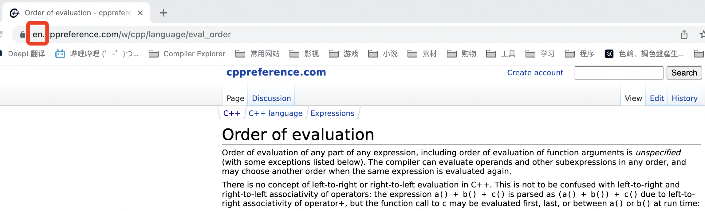

***********************************************************************************************************************
在哪查找中文的 C++ 资料?
***********************************************************************************************************************

很多时候, 我们都需要与 C++ 语言及标准库里的东西打交道 (例如语言特性中的函数传参, 运算符结合性和求值顺序, 标准库中的 :cpp:`std::cout`, :cpp:`std::string`, :cpp:`std::vector`, :cpp:`std::array` 等), 然而网上检索的结果都 **太乱太散且不一定正确**.

那么有没有什么网站是可以很 **便捷地** 查找到官方性的资料, 及相关示例的呢?

有, `cppreference`_.

然而由于网站内置的搜索引擎为国内无法直接连接上的 DuckDuckGoog, 而百度搜索引擎屏蔽了该网站. 要想灵活地在 cppreference 中检索所需的资料, 我们需要一些间接的手段.

=======================================================================================================================
如何检索
=======================================================================================================================

请使用这个已 "配置" 好的必应搜索链接: `cppreference 检索`_.

浏览器打开后如图所示, 要想搜索内容, 在 ``site:en.cppreference.com/w/`` 之后 :KBD:`空格` 并 **添加你想要搜索的内容**, :KBD:`回车` 即可.

  cppreference 示意

例如, 我想要看看 :cpp:`std::vector` 的详细信息, 即为 ``site:en.cppreference.com/w/ vector``.

而我想要看看 **求值顺序** 的详细信息, 一般来说可以直接搜索 ``site:en.cppreference.com/w/ 求值顺序``, 搜索引擎会很聪明地为你找到对应的英文结果.

.. warning::

  需要注意的是, 该网站同时也可检索 C 语言的资料, 当然进入网页后, 这很容易区分出来.

  你也可以通过地址进行区分.

  .. figure:: 2.png
  
    通过地址区分 C 和 C++

=======================================================================================================================
更改语言
=======================================================================================================================

进入网站后, 会发现网站是英文的.

要想更改成中文, 点击如图所示的地址栏, 将红框处的 ``en`` (English), 改为 ``zh`` (中华), :KBD:`回车` 即可.

  通过地址更改语言

你也可以翻到网页的底部, 点击 ``中文``.

.. figure:: 4.png

  通过网页底部更改语言

.. warning::

  cppreference 的中文网页与英文原版相比版本较旧, 可能还没有更新特定的内容, 或者缺少示例.

=======================================================================================================================
网页的字体太小了?
=======================================================================================================================

.. warning::

  以下内容使用的是谷歌浏览器 Chrome, 其余浏览器未经测试.

Windows 系统按 :KBD:`Ctrl-+`, MacOS 系统按 :KBD:`Command-+` 即可放大当前网页.

=======================================================================================================================
筛选要查看的版本
=======================================================================================================================

.. warning::

  目前仅英文原网页支持该功能.

C++ 标准是不断更新的, 这就导致 cppreference 需要根据版本变化对内容进行区分说明.

例如, 针对 `求值顺序 <https://en.cppreference.com/w/cpp/language/eval_order>`_, C++17 在 C++11 基础上进行了更进一步地要求, 反映在页面上则如下图所示:

  C++17 对求值顺序的改动

但有时只显示单个版本的内容会更加清晰.

cppreference 为此在网页开头提供了切换版本的功能:

  切换版本