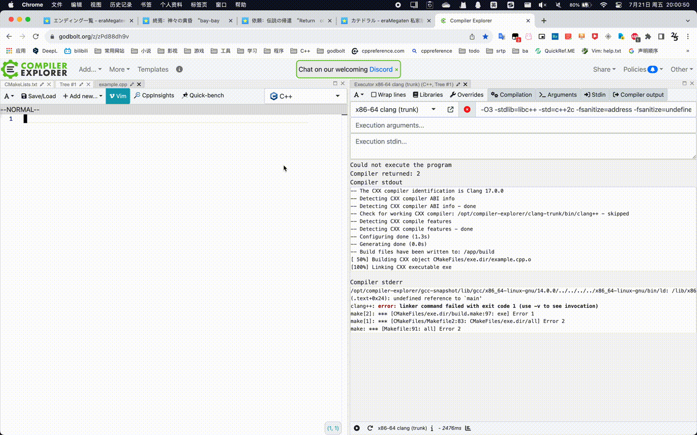
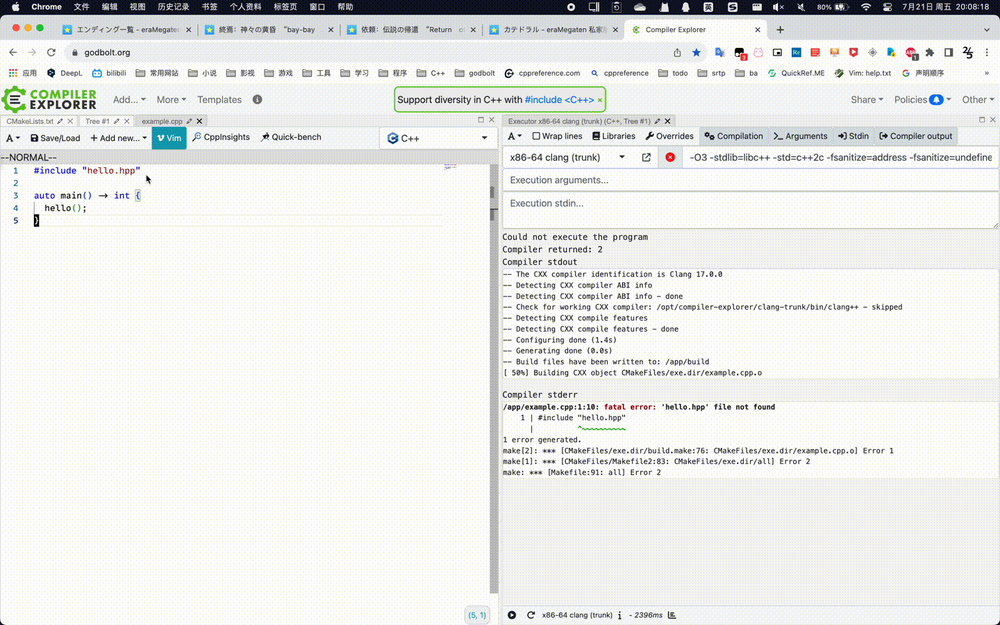

************************************************************************************************************************
如何用网页链接分享代码?
************************************************************************************************************************

我个人推荐使用 Compiler Explorer 分享代码, 它是目前我已知 **最好的在线编译器**. 在上面写好代码后, 点击右上角的 :menuselection:`Share` 即可进行分享.

========================================================================================================================
单源文件项目分享
========================================================================================================================

:godbolt:`9vrM5MEP7`

  分享方法

========================================================================================================================
多源文件项目分享
========================================================================================================================

:godbolt:`b5x8EbE9f`

  分享方法

========================================================================================================================
我常用的 Compiler Explorer 配置
========================================================================================================================

以下是我常用的一些 Compiler Explorer 配置, 相较于默认配置添加了非常多的检查 (例如下标越界等). 如果需要配置这样检查的软件, 请阅读 :ref:`VSCode 配置教程 (Windows/MacOS/Linux 均可用) <vscode_cpp_starter:main>` 或 :ref:`Visual Studio 配置教程 (Windows 可用) <vscode_cpp_starter:vs>`.

- :godbolt:`clang <fsrxYYav9>`
- :godbolt:`clang - 单源文件项目 <oja4MEvzr>`
- :godbolt:`clang - 多源文件项目 <o68aKEYM7>`
- :godbolt:`gcc <Mqvvv88xT>`
- :godbolt:`msvc (Visual Studio 的编译器) <EbWjP7j44>`
- :godbolt:`同时运行 clang、gcc、msvc <z37jWdc6a>`

========================================================================================================================
参考文献
========================================================================================================================

- C++ Weekly

  - `SE.clang-tidy Auto Fixes in Compiler Explorer - Tribute to Hubert Matthews <https://www.youtube.com/watch?v=EfYMKOMc738>`_
  - `172.Execution Support in Compiler Explorer <https://www.youtube.com/watch?v=4h8IOiu-K1c>`_

- `Compiler Explorer Wiki <https://github.com/compiler-explorer/compiler-explorer>`_
- `What's New in Compiler Explorer? - Matt Godbolt - C++ on Sea 2023 <https://www.youtube.com/watch?v=O5sEug_iaf4>`_
- `What's New in Compiler Explorer? 2024 Update - Matt Godbolt - C++Online 2024 <https://www.youtube.com/watch?v=28Gp3TTQYp0>`_